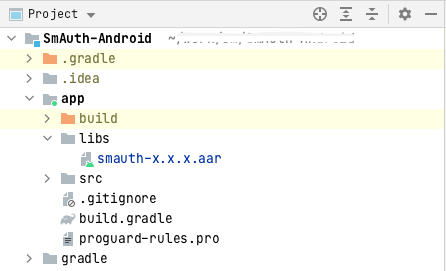
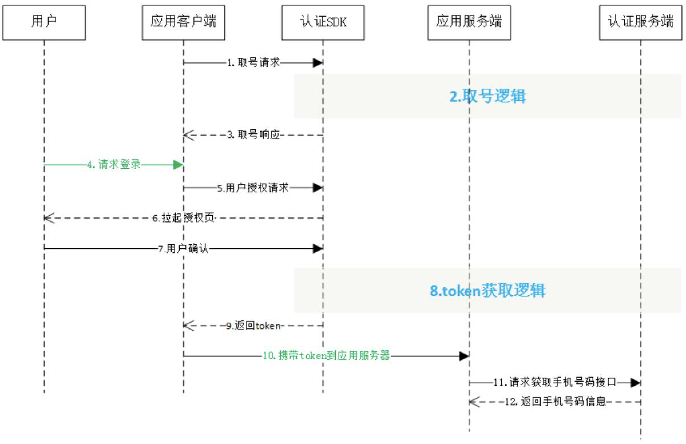
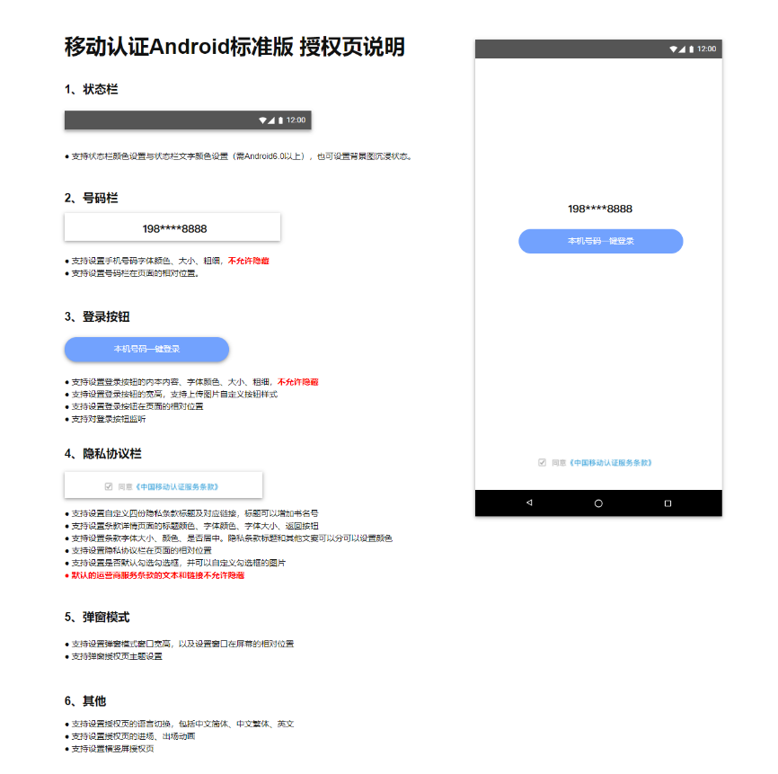
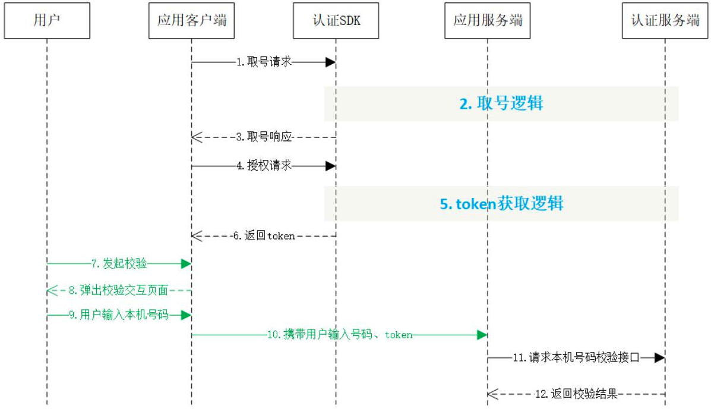

# 数美认证 SDK 接入文档

## 1 开发环境配置

SDK 支持版本：Android 4.0 及以上

**注意事项：**

1. 数美认证由中国移动北京公司提供技术支持，避免项目同时接入中国移动认证 SDK 和本 SDK
1. 一键登录服务必须打开蜂窝数据流量并且手机操作系统给予应用蜂窝数据权限才能使用
2. 取号请求过程需要消耗用户少量数据流量（国外漫游时可能会产生额外的费用）
3. 一键登录服务目前支持中国移动 2/3/4G（2G, 3G 因为无线网络环境问题，时延和成功率会比 4G 低） 和中国电信 4G、中国联通 4G

### 1.1 导入 SDK 包

1. 将 `smauth-${verison}.aar` 拷贝到 app  Module 的 libs 目录，如图所示

   

   `smauth-x.x.x.aar` 名称中的 `x.x.x` 代表版本号，如 `smauth-1.0.0.aar`

2. 在 `app/build.gradle` 文件中添加如下配置

```groovy
dependencies {
	// 需要将 SDK 添加到 libs 中，并将 smauth-x.x.x.aar 替换为对应版本 SDK
	implementation fileTree(dir: "libs", include: ["smauth-x.x.x.aar"])
}
```

3. 在 `AndroidManifest.xml` 文件中添加权限

```xml
<!-- 添加必要的权限支持 -->
<uses-permission android:name="android.permission.INTERNET" />
<uses-permission android:name="android.permission.ACCESS_WIFI_STATE" />
<uses-permission android:name="android.permission.ACCESS_NETWORK_STATE" />
<uses-permission android:name="android.permission.CHANGE_NETWORK_STATE" />

<!-- 建议的权限 -->
<!-- 强烈建议开发者申请本权限，本权限主要用于在双卡情况下，更精准的获取数据流量卡的运营商类型 --> 
<!-- 缺少该权限，存在取号失败概率上升的风险。 -->
<!-- 同时，向用户申请此权限时，请按照国家相关法规向用户说明权限的用途，尊重用户个人隐私。 -->
<uses-permission android:name="android.permission.READ_PHONE_STATE" />
```

权限说明

| 权限                 | 说明                                       |
| -------------------- | ------------------------------------------ |
| INTERNET             | 允许应用程序联网，用于访问网关和认证服务器 |
| READ_PHONE_STATE     | 获取 imsi 用于判断双卡和换卡               |
| ACCESS_WIFI_STATE    | 允许程序访问 WiFi 网络状态信息             |
| ACCESS_NETWORK_STATE | 获取网络状态，判断是否数据、wifi 等        |
| CHANGE_NETWORK_STATE | 允许程序改变网络连接状态                   |

4. 配置授权登录 **activity**

```xml
<activity
  android:name="com.cmic.gen.sdk.view.GenLoginAuthActivity"
  android:configChanges="orientation|keyboardHidden|screenSize"
  android:launchMode="singleTop"
  android:screenOrientation="unspecified" />
```

5. SDK 最低支持 Android API LEVEL 14，确保项目 minSdkVersion 版本不小于 14

```groovy
// build.gradle
android {
  ...
  defaultConfig {
    minSdkVersion 14
    ...
  }
  ...
}
```

上述导入过程是在 Android Studio 进行，如在其他 IDE 中使用 SDK 需要自行适配。


### 1.2 SDK 代码接入

#### 1.2.1 创建 SmAuthHelper 实例

SmAuthHelper 是 SDK 的功能入口，所有的接口调用都得通过 SmAuthHelper 进行调用。因此，调用 SDK，首先需要创建一个 SmAuthHelper 实例

方法原型

```java
public static SmAuthHelper getInstance(Context context)
```

参数说明

| 参数    | 类型    | 说明                                                   |
| ------- | ------- | ------------------------------------------------------ |
| context | Context | 调用者的上下文环境，其中 activity 中 this 即可以代表。 |

示例代码

```java
public void onCreate(Bundle savedInstanceState) { 
  super.onCreate(savedInstanceState); 
  mContext = this; 
  mSmAuthHelper = SmAuthHelper.getInstance(mContext); 
}
```

#### 1.2.2 实现回调

所有的 SDK 接口调用，都会传入一个回调，用于接收 SDK 返回的调用结果。结果为 `SDKRequestCode` 与 `JSONObject`。`SDKRequestCode` 为请求标识码，与请求参数中的 SDKRequestCode 呼应，SDKRequestCode = 用户传的 requestCode，如果开发者没有传 requestCode，那么 SDKRequestCode = -1

`TokenListener` 的实现示例代码如下

```java
mListener = new TokenListener() { 
  @Override 
  public void onGetTokenComplete(int SDKRequestCode, JSONObject jObj) { 
    if (jObj != null) {
      mResultString = jObj.toString(); 
      mHandler.sendEmptyMessage(RESULT); 
      if (jObj.has("token")) { 
        mtoken = jObj.optString("token"); 
      } 
    } 
  }
}
```


## 2 一键登录功能

### 2.1 使用流程说明



### 2.2 取号请求

本方法用于发起取号请求，SDK 完成网络判断、蜂窝数据网络切换等操作并缓存凭证 scrip。缓存允许用户在未开启蜂窝网络时成功取号。 取号接口使用 http 请求，开发者需按照安卓网络安全配置适配。 Android P 及以上可降低 targetSdkVersion 版本，或在 res 的 xml 目录下，新建一个 xml 文件(名称自定义，如：network_security_config.xml)

```xml
<?xml version="1.0" encoding="utf-8"?> 
<network-security-config> 
  <base-config cleartextTrafficPermitted="true" /> 
</network-security-config>
```

并在 manifest 清单文件配置

```xml
<application 
    ... 
    android:networkSecurityConfig="@xml/network_security_config" 
    ... 
/>
```

取号方法原型

```java
public void getPhoneInfo(final String appId, 
                         final String appKey, 
                         final TokenListener listener, 
                         final int requestCode)
```

参数说明

| 参数        | 类型         | 说明                                                         |
| ----------- | ------------ | ------------------------------------------------------------ |
| appId       | String       | 应用的 AppID                                                 |
| appkey      | String       | 应用密钥                                                     |
| listener    | TokenListene | TokenListener 为回调监听器，是一个 java 接口，需要调用者自己实现；<br />TokenListener 是接口中的认证登录 token 回调接口，OnGetTokenComplete 是该接口中唯一的抽象方法，即 `void OnGetTokenComplete(JSONObject jsonobj)` |
| requestCode | int          | 请求标识码。<br />与响应参数中的 SDKRequestCode 呼应，SDKRequestCode = 用户传的 requestCode，如果开发者没有传 requestCode，那么 SDKRequestCode = -1 |

响应参数，OnGetTokenComplete 的参数 JSONObject，含义如下

| 字段                         | 类型   | 含义                                                   |
| ---------------------------- | ------ | ------------------------------------------------------ |
| resultCode                   | String | 接口返回码，`"103000"` 为成功。具体返回码见 SDK 返回码 |
| desc/resultString/resultDesc | String | 成功标识，true 为成功。                                |
| traceId                      | String | 主要用于定位问题                                       |

示例代码

```java
/*** 判断和获取 READ_PHONE_STATE 权限逻辑 ***/

// 创建 SmAuthHelper 实例
public void onCreate(Bundle savedInstanceState) { 
    super.onCreate(savedInstanceState); 
    mContext = this; 
    mSmAuthHelper = SmAuthHelper.getInstance(mContext); 
} 

// 实现取号回调 
mListener = new TokenListener() { 
    @Override 
    public void onGetTokenComplete(int SDKRequestCode, JSONObject jObj) {
        // 应用接收到回调后的处理逻辑 
    } 
};

// 调用取号方法
mSmAuthHelper.getPhoneInfo(APP_ID, APP_KEY, mListener, requestCode);
```

### 2.3 授权请求

应用调用本方法时，SDK 将拉起用户授权页面，用户确认授权后，SDK 将返回 token 给应用客户端。可通过返回码 200087 监听授权页是否成功拉起。

#### 2.3.1 授权请求方法原型

```java
public void loginAuth(final String appId, 
                      final String appKey, 
                      final TokenListener listener,
                      final int requestCode)
```

请求参数

| 参数        | 类型          | 说明                                                         |
| ----------- | ------------- | ------------------------------------------------------------ |
| appId       | String        | 应用的 AppID                                                 |
| appkey      | String        | 应用密钥                                                     |
| listener    | TokenListener | TokenListener 为回调监听器，是一个 java 接口， 需要调用者自己实现；<br />TokenListener 是接口中的 认证登录 token 回调接口，OnGetTokenComplete 是该接口中唯一的抽象方法，即 `void OnGetTokenComplete(JSONObject jsonobj)` |
| requestCode | int           | 请求标识码。与响应参数中的 SDKRequestCode 呼应，SDKRequestCode = 用户传的 requestCode，如果开发者没有传 requestCode，那么 SDKRequestCode = -1 |

响应参数

OnGetTokenComplete 的参数 JSONObject，含义如下

| 字段                         | 类型   | 含义                                                         |
| ---------------------------- | ------ | ------------------------------------------------------------ |
| resultCode                   | String | 接口返回码，`"103000"`为成功。具体响应码见 SDK 返回码        |
| desc/resultString/resultDesc | String | 失败时返回：返回错误码说明                                   |
| authType                     | String | 认证类型： <br />    0: 其他；<br />    1:WiFi 下网关鉴权；<br />    2:网关鉴权； |
| authTypeDes                  | String | 认证类型描述，对应 authType                                  |
| token                        | String | 成功时返回：临时凭证，token 有效期 2min，一次有效；<br />同一用户（手机号）10 分钟内获取 token 且未使用的数量不超过 30 个 |
| traceId                      | String | 主要用于定位问题                                             |

示例代码

```java
// 创建 SmAuthHelper 实例 
public void onCreate(Bundle savedInstanceState) { 
  super.onCreate(savedInstanceState); 
  mContext = this; 
  mSmAuthHelper = SmAuthHelper.getInstance(mContext); 
} 

// 实现取号回调 
mListener = new TokenListener() { 
  @Override 
  public void onGetTokenComplete(int SDKRequestCode, JSONObject jObj) {
    // 应用接收到回调后的处理逻辑 
  } 
};

//调用一键登录方法
mSmAuthHelper.loginAuth(APP_ID, APP_KEY, mListener, requestCode);
```

#### 2.3.2 授权页面的回调方法

| 方法名         | 说明                         |
| -------------- | ---------------------------- |
| pageInListener | 可以获得授权页面是否成功回调 |

示例代码

```java
mSmAuthHelper.setPageInListener(new LoginPageInListener() { 
  @Override 
  public void onLoginPageInComplete(String resultCode, JSONObject jsonObj) { 
    if(resultCode.equals("200087")){ 
      Log.d("initSDK","page in---------------"); 
    } 
  } 
});
```

### 2.4 授权页面设计

为了确保用户在登录过程中将手机号码信息授权给开发者使用的知情权，一键登录需要开发者提供授权页登录页面供用户授权确认。开发者在调用授权登录方法前，必须弹出授权页，明确告知用户当前操作会将用户的本机号码信息传递给应用。

#### 2.4.1 页面规范细则

 

**注意：**

1. **开发者不得通过任何技术手段，破解授权页，或将授权页面的号码栏、隐私栏、品牌露出内容隐藏、覆盖。**
2. **登录按钮文字描述必须包含 “登录” 或 “注册” 等文字，不得诱导用户授权。**
3. **对于接入移动认证 SDK 并上线的应用，我方会对上线的应用授权页面做审查，如果有出现未按要求弹出或设计授权页面的，将关闭应用的认证取号服务。**

#### 2.4.2 修改页面主题

开发者可以通过 `setAuthThemeConfig` 方法修改授权页面主题

方法原型

```java
public void setAuthThemeConfig(AuthThemeConfig authThemeConfig)
```

参数说明

| 参数            | 类型            | 说明                                                         |
| --------------- | --------------- | ------------------------------------------------------------ |
| authThemeConfig | AuthThemeConfig | 主题配置对象，由 AuthThemeConfig.Builder().build()创建，开发者通过对 builder 中调用对应的方法配置授权页中对应的元素 |

AuthThemeConfig.java 配置元素说明

**状态栏**

| 方法         | 说明                                                         |
| ------------ | ------------------------------------------------------------ |
| setStatusBar | 设置状态栏颜色（系统版本 5.0 以上可设置）、字体颜色（系统版本 6.0 以上可设置黑色、白色）。 |

**服务条款导航栏**

| 方法                 | 说明                                            |
| -------------------- | ----------------------------------------------- |
| setNavTextColor      | 设置服务条款标题字体颜色                        |
| setNavColor          | 设置服务条款标题颜色                            |
| setNavTextSize       | 设置服务条款标题字体大小                        |
| setClauseLayoutResID | 设置服务条款标题布局资源文件 ID（包括返回按钮） |

**授权页布局**

| 方法               | 说明                    |
| ------------------ | ----------------------- |
| setAuthContentView | 设置授权页布局显示 View |
| setAuthLayoutResID | 设置授权页布局文件 ID   |

**安卓底部导航栏自适应**

| 方法                 | 说明                                                         |
| -------------------- | ------------------------------------------------------------ |
| setFitsSystemWindows | 开启安卓底部导航栏自适应，开启后，导航栏唤起时，授权页面元素也会相对变化；<br />不开启自适应，自定义内容可以铺满全屏，设置状态栏透明后，可以达到沉浸式显示效果。<br />0: 开启自适应（默认开启）<br />1: 关闭自适应 |

**授权页号码栏**

| 方法                 | 说明                                  |
| -------------------- | ------------------------------------- |
| setNumberColor       | 设置手机号码字体颜色                  |
| setNumberSize        | 设置号码栏字体大小、字体粗细          |
| setNumFieldOffsetY   | 设置号码栏相对于状态栏下边缘 y 偏移   |
| setNumFieldOffsetY_B | 设置号码栏相对于底部 y 偏移           |
| setNumberOffsetX     | 设置号码栏相对于默认位置的 x 轴偏移量 |

**授权页登录按钮**

| 方法                   | 说明                                               |
| ---------------------- | -------------------------------------------------- |
| setLogBtnText          | 设置登录按钮文本内容、字体颜色、字体大小、字体粗细 |
| setLogBtnImgPath       | 设置授权登录按钮图片                               |
| setLogBtn              | 设置登录按钮的宽高                                 |
| setLogBtnMargin        | 设置登录按钮相对于屏幕左右边缘边距                 |
| setLogBtnOffsetY       | 设置登录按钮相对于状态栏下边缘 y 偏移              |
| setLogBtnOffsetY_B     | 设置登录按钮相对于底部 y 偏移                      |
| setLogBtnClickListener | 设置登录按钮点击监听事件                           |

**授权页隐私栏**

| 方法                     | 说明                                                         |
| ------------------------ | ------------------------------------------------------------ |
| setPrivacyAlignment      | 设置隐私条款的协议文本，自定义条款，自定义条款链接（支持四份条款） |
| setPrivacyText           | 设置隐私条款的字体大小，文本颜色，是否居中。协议标题和其他文案可以分开设置文本颜色 |
| setCheckBoxImgPath       | 设置复选框图片                                               |
| setCheckTipText          | 设置未勾选提示的自定义提示文案。不设置则无提示               |
| setPrivacyOffsetY        | 设置隐私条款相对于状态栏下边缘 y 偏移                        |
| setPrivacyOffsetY_B      | 设置隐私条款相对于底部 y 偏移                                |
| setPrivacyMargin         | 设置隐私条款距离手机左右边缘的边距                           |
| setPrivacyState          | 设置是否默认勾选复选框                                       |
| setPrivacyBookSymbol     | 设置书名号，0=设置，1=不设置，默认设置                       |
| setCheckBoxLocation      | 设置复选框相对右侧协议文案居上或者居中，默认居上。0-居上，1-居中 |
| setCheckedChangeListener | 设置授权页勾选框是否勾选的监听事件                           |

**授权页转场动画**

| 方法              | 说明               |
| ----------------- | ------------------ |
| setAuthPageActIn  | 设置授权页进场动画 |
| setAuthPageActOut | 设置授权页出场动画 |

**弹窗模式**

| 方法                    | 说明                                                         |
| ----------------------- | ------------------------------------------------------------ |
| setAuthPageWindowMode   | 设置授权页窗口宽高比例                                       |
| setAuthPageWindowOffset | 设置授权页窗口 X 轴 Y 轴偏移                                 |
| setWindowBottom         | 设置授权页是否居于底部，0=居中；1=底部，设置为 1Y 轴的偏移失效 |
| setThemeId              | 设置授权页弹窗主题，也可在 Manifest 设置                     |
| setBackButton           | 弹窗授权页模式下，设置物理返回键是否有效，默认有效。true=有效，false=无效。 |

**授权页语言切换**

| model 属性      | 属性说明                     |
| --------------- | ---------------------------- |
| appLanguageType | 0.中文简体 1.中文繁体 2.英文 |

**返回键监听**

| 方法                   | 说明                                 |
| ---------------------- | ------------------------------------ |
| setBackPressedListener | 设置授权页返回键监听事件             |
| setCheckBoxListener    | 设置授权页勾选框和登录按钮的监听事件 |

#### 2.4.3 finish 授权页

SDK 完成回调后，**不会立即关闭授权页面**，需要开发者主动调用离开授权页面方法去完成页面的关闭

方法原型

```java
public void quitAuthActivity()
```


## 3 本机号码校验

### 3.1 使用流程说明



### 3.2 取号请求

详情可参考一键登录的取号请求说明

### 3.3 本机号码校验请求 token

开发者可以在应用内部任意页面调用本方法，获取本机号码校验的接口调用凭证（token）

本机号码校验方法原型

```java
public void mobileAuth(final String appId, 
                       final String appKey, 
                       final TokenListener listener, 
                       final int requestCode)
```

请求参数说明

| 参数        | 类型          | 说明                                                         |
| ----------- | ------------- | ------------------------------------------------------------ |
| appId       | String        | 应用的 AppID                                                 |
| appkey      | String        | 应用密钥                                                     |
| listener    | TokenListener | TokenListener 为回调监听器，是一个 java 接口，需要调用者自己实现；TokenListener 是接口中的认证登录 token 回调接口，OnGetTokenComplete 是该接口中唯一的抽象方法，即 `void OnGetTokenComplete(JSONObject jsonobj)` |
| requestCode | int           | 请求标识码。与响应参数中的 SDKRequestCode 呼应，SDKRequestCode = 用户传的 requestCode，如果开发者没有传 requestCode，那么 SDKRequestCode = -1 |

响应参数

OnGetTokenComplete 的参数 JSONObject，含义如下

| 字段        | 类型   | 含义                                                         |
| ----------- | ------ | ------------------------------------------------------------ |
| resultCode  | String | 接口返回码，`"103000"` 为成功。具体响应码见 SDK 返回码       |
| authType    | String | 登录类型。                                                   |
| authTypeDes | String | 登录类型中文描述。                                           |
| token       | String | 成功返回: 临时凭证<br />token 有效期 2min，一次有效，同一用户（手机号）10 分钟内获取 token 且未使用的数量不超过 30 个 |
| traceId     | String | 主要用于定位问题                                             |

示例代码

```java
// 创建 SmAuthHelper 实例 
public void onCreate(Bundle savedInstanceState) { 
  super.onCreate(savedInstanceState); 
  mContext = this;
  mSmAuthHelper = SmAuthHelper.getInstance(mContext); 
} 

// 实现校验回调 
mListener = new TokenListener() {
  @Override 
  public void onGetTokenComplete(int SDKRequestCode, JSONObject jObj) {
    // 应用接收到回调后的处理逻辑 
  } 
};

// 调用本机号码校验方法 
mSmAuthHelper.mobileAuth(APP_ID, APP_KEY, mListener, requestCode);
```


## 4 其它 SDK 请求方法

### 4.1 获取网络状态和运营商类型

原型

```java
public JSONObject getNetworkType(Context context)
```

请求参数

| 参数    | 类型    | 说明       |
| ------- | ------- | ---------- |
| context | Context | 上下文对象 |

响应参数

参数 JSONObject，含义如下

| 参数         | 类型   | 说明                                                         |
| ------------ | ------ | ------------------------------------------------------------ |
| operatorType | String | 运营商类型： <br /> 1.移动流量；<br /> 2.联通流量； <br /> 3.电信流量 |
| networkType  | String | 网络类型：<br /> 0.未知； <br /> 1.流量； <br /> 2.wifi；<br /> 3.数据流量+wifi |

### 4.2 **删除临时取号凭证** 

开发者取号或者授权成功后，SDK 将取号的一个临时凭证缓存在本地，缓存允许用户在未开启蜂窝网络时成功取号。开发者可以使用本方法删除该缓存凭证。 

原型

```java
public void delScrip()
```

### 4.3 设置取号超时

设置取号超时时间，默认为 8000 毫秒。

开发者设置取号请求方法（getPhoneInfo）、授权请求方法（loginAuth），本机号码校验请求 token 方法（mobileAuth）的超时时间。开发者在使用 SDK 方法前，可以通过本方法设置将要使用的方法的超时时间。

原型

```java
public void setOverTime(long overTime)
```

请求参数

| 参数     | 类型 | 说明                       |
| -------- | ---- | -------------------------- |
| overTime | long | 设置超时时间（单位：毫秒） |


## 5 SDK 返回码说明

|返回码 |返回码描述 |
|---|---|
|103000 |成功 |
|102507 |登录超时（授权页点登录按钮时） |
|103101 |请求签名错误（若发生在客户端，可能是 appkey 传错，可检查是否跟 appsecret 弄混，或者有空格。若发生在服务端接口，需要检查验签方式是 MD5 还是 RSA， 如果是 MD5，则排查 signType 字段，若为 appsecret，需确认是否误用了 appkey 生签。如果是 RSA，需要检查使用的私钥跟报备的公钥是否对应和报文拼接是 否符合文档要求。） |
|103102 |包签名错误（社区填写的 appid 和对应的包名包签名必须一致） |
|103111 |网关 IP 错误（检查是否开了 vpn 或者境外 ip） |
|103119 |appid 不存在（检查传的 appid 是否正确或是否有空格） |
|103211 |其他错误，（常见于报文格式不对，先请检查是否符合这三个要求：a、json 形 式的报文交互必须是标准的 json 格式；b、发送时请设置 content type 为 application/json；c、参数类型都是 String。如有需要请联系数美客服） |
|103412 |无效的请求（1.加密方式错误；2.非 json 格式；3.空请求等） |
|103414 |参数校验异常 |
|103511 |服务器 ip 白名单校验失败 |
|103811 |token 为空 |
|103902 |scrip 失效（客户端高频调用请求 token 接口） |
|103911 |token 请求过于频繁，10 分钟内获取 token 且未使用的数量不超过 30 个 |
|104201 |token 已失效或不存在（重复校验或失效）|
|105001 |联通取号失败 |
|105002 |移动取号失败（一般是物联网卡） |
|105003 |电信取号失败 |
|105012 |不支持电信取号 |
|105013 |不支持联通取号 |
|105018 |token 权限不足（使用了本机号码校验的 token 获取号码） |
|105019 |应用未授权（未在开发者社区勾选能力） |
|105021 |当天已达取号限额 |
|105302 |appid 不在白名单 |
|105312 |余量不足（体验版到期或套餐用完） |
|105313 |非法请求 |
|200002 |用户未安装 sim 卡 |
|200005 |用户未授权（READ_PHONE_STATE） |
|200020 |授权页关闭 |
|200021 |数据解析异常（一般是卡欠费） |
|200022 |无网络 |
|200023 |请求超时 |
|200024 |数据网络切换失败 |
|200025 |其他错误（socket、系统未授权数据蜂窝权限等，如需要协助，请联系数美客服）|
|200026 |输入参数错误 |
|200027 |未开启数据网络或网络不稳定 |
|200028 |网络异常 |
|200038 |异网取号网络请求失败 |
|200039 |异网取号网关取号失败 |
|200040 |UI 资源加载异常 |
|200050 |EOF 异常 |
|200072 |CA 根证书校验失败 |
|200080 |本机号码校验仅支持移动手机号 |
|200082 |服务器繁忙 |
|200087 |授权页成功调起|
