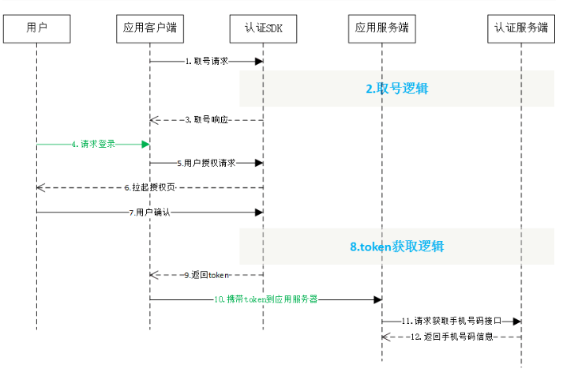
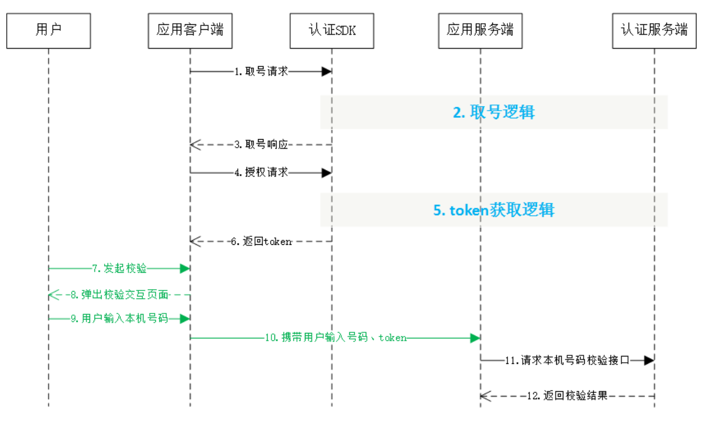

#  1. 接入指南

sdk 支持版本：iOS 8. 0及以上

**注意事项：**


1. 一键登录服务必须打开蜂窝数据流量并且手机操作系统给予应用蜂窝数据权限才能使用
1. 数美认证由中国移动北京公司提供技术支持，避免项目同时接入中国移动认证 SDK 和本 SDK
2. 取号请求过程需要消耗用户少量数据流量（国外漫游时可能会产生额外的费用）
3. 一键登录服务目前支持中国移动 2/3/4/5G（ 2 , 3G因为无线网络环境问题，时延和成功率会比 4 G低）
和中国电信 4G、中国联通 4G、5G（如有更新会在技术沟通QQ群上通知）
4. 该 SDK 版本带有 UI 逻辑（授权页和服务条款页）
5. 关于双卡的适配问题：
当两张卡的运营商不一致时，SDK 会获取设备上网卡的运营商并进行取号，但上网卡不一定
会获取成功（飞行模式状态时），若获取失败，SDK 将默认取号卡为移动运营商取号，如果
匹配，则取号成功，否则 SDK 返回 103111 ；
当 SDK 存在缓存并且两张卡的运营商不相同时，SDK 会重新获取上网卡运营商与上一次取号
的运营商进行对比，若两次运营商不一致，则以最新设置的上网卡的运营商为准，重新取
号，上次获取的缓存将自动失效；双卡运营商相同的情况则不需要重新取号。
iOS 13 上已完成双卡适配，SDK 通过苹果提供的方法获取运营商，若获取失败，SDK 将默认
取号卡为移动运营商取号，如果匹配，则取号成功，否则 SDK 返回 103111 。

## 1.1 开发流程

**第一步：下载SDK及相关文档**

请在开发者群或官网下载最新的 SDK 包

**第二步：搭建开发环境**

1. xcode 版本需使用 12.0 以上，否则会报错
2. 导入认证 SDK 的 .xcframework，在 Xcode 的 TARGETS 的 `Framework,Libraries,and Embedded Content`  中，点击 '+' 号，点击 add Other, 选择 .xcframework 添加依赖
3. 在Xcode中找到 TARGETS-->Build Setting-->Linking-->Other Linker Flags 在这选项中需要添加`-ObjC`
注意:如果以上操作仍然出现 `unrecognized selector sent to instance` 找不到方法的报错,则添加更改为
`-all_load`
4. 资源文件:在 Xcode 中务必导入 TYRZResource.bundle 到项目中，否则授权界面显示异常（不显示默
认图片）。 TARGETS-->Build Phases-->Copy Bundle Resources-> 点击 "+" --> Add
Other --> SmAuth.xcframework --> ios-arm64_armv7 -->SmAuth.framework -->TYRZResource.bundle --> Open
5. 导入sdk语句：#import <SmAuth/SmAuth.h>，导入后才能调用 SDK 的方法
6. 在 info.plist 文件中添加一个子项目 App Transport Security Settings，然后在其中添加一个 key：Allow
Arbitrary Loads，其值为 YES 。修改后其他运营商才能使用一键登录。
7. 添加依赖库，在项目设置 TARGETS -> 选项卡Build Phase -> Linked
Binary with Libraries 添加如下依赖库：Network.framework，并将 status 设置为 Optional。


**第三步：开始使用移动认证SDK**

**[1] 初始化 SDK**

在 appDelegate.m 文件的 didFinishLaunchingWithOptions 函数中添加初始化代码。初始化代码只需要执行一次就可以。
```objective-c
- (BOOL)application:(UIApplication *)application didFinishLaunchingWithOptions:
(NSDictionary *)launchOptions {
	[[SmAuthHelper shareInstance] registerAppId:@"xxxxxx" AppKey:@"xxxxxx"];
	return YES;
}
```

**方法原型：**

```objective-c
- (void)registerAppId:(NSString *)appId AppKey:(NSString *)appKey;
```

**参数说明：**

| 参数   | 类型     | 说明        |
| ------ | -------- | ----------- |
| appId  | NSString | 应用的appid |
| appKey | NSString | 应用密钥    |

# 2. 一键登录功能

## 2.1 流程说明




## 2.2 取号请求

本方法用于发起取号请求，SDK 完成网络判断、蜂窝数据网络切换等操作并缓存凭证 script。

**取号方法原型**

```objective-c
- (void)getPhoneNumberCompletion:(void(^)(NSDictionary *_Nonnull result))completion;
```

**参数说明：**


|参数|类型|说明|
|--|--|--|
|completion|Block|取号回调|

**响应参数：**

| 参数       | 类型     | 说明             |
| ---------- | -------- | ---------------- |
| resultCode | NSString | 返回相应的结果码 |
| desc       | NSString | 调用描述         |

**请求示例代码**

```objective-c
[[SmAuthHelper shareInstance] getPhoneNumberCompletion:^(NSDictionary * _Nonnull sender) {
        NSString *resultCode = sender[@"resultCode"];
        NSMutableDictionary *result = [NSMutableDictionary dictionaryWithDictionary:sender];
        NSLog(@"预取号 ： %@",result);
        if ([resultCode isEqualToString:@"103000"]) {
            NSLog(@"预取号成功");
        } else {
            NSLog(@"预取号失败");
        }
}];
```

## 2.3 授权请求

应用调用本方法时，SDK 将拉起用户授权页面，用户确认授权后，SDK 将返回 token 给应用客户端。可通过返回码 200087 监听授权页是否成功拉起。

**授权请求方法原型：**

```objective-c
- (void)getAuthorizationWithModel:(SmCustomModel *)model complete:(void (^)(id sender))completion;
```

**请求参数：**

| **参数**   | **类型**      | **说明**                        |
| ---------- | ------------- | ------------------------------- |
| model      | SmCustomModel | 需要配置的Model属性(控制器必传) |
| completion | Block         | 取号回调                        |

 **响应参数：**

| **参数**   | **类型** | **说明**                                                     |
| ---------- | -------- | ------------------------------------------------------------ |
| resultCode | NSString | 返回相应的结果码                                             |
| token      | NSString | 成功时返回:临时凭证，token有效期2min，一次有效，同一用户(手 机号)10分钟内获取token且未使用的数量不超过30个 |

**请求示例代码**

```objective-c
SmCustomModel *model = [[SmCustomModel alloc]init];
model.currentVC = self;//必传
model.authPageBackgroundImage = [UIImage imageNamed:@"tooopen_sy_122409821526"];
// model.numberSize = 10;
// model.navReturnImg = [UIImage imageNamed:@"tooopen_sy_122409821526"];
// model.logBtnImgs = @[[UIImage imageNamed:@"12341553737084_.pic_hd"],[UIImage
imageNamed:@"12341553737084_.pic_hd"],[UIImage imageNamed:@"12341553737084_.pic_hd"]];
// model.logBtnImgs = []
// model.authViewBlock = ^(UIView *customView) {
// UIImageView *ima = [[UIImageView alloc]initWithImage:[UIImage
imageNamed:@"tooopen_sy_122409821526"]];
// ima.frame = customView.bounds;
// [customView addSubview:ima];
// };
// model.customSMSFlag = YES;
[[SmAuthHelper shareInstance] getAuthorizationWithModel:model complete:^(NSDictionary *
_Nonnull sender) {
// NSDecimalNumber *end = [self.class stopLoading];
// NSDecimalNumberHandler *subHandler = [self.class roundPlainWithScale:3];
// NSDecimalNumber *delta = [end decimalNumberBySubtracting:beginwithBehavior:subHandler];
// NSMutableDictionary *result = [sender mutableCopy];
// result[@"duration"] = delta;
// [self displayObject:result withTitle:@"一键登录"
  alertActionHandler:^(UIAlertAction * _Nonnull action) {
  // [self dismissViewControllerAnimated:YES completion:nil];
  [self displayObject:sender];

  // }];
}];
```

## 2.4 授权页面设计

为了确保用户在登录过程中将手机号码信息授权给开发者使用的知情权，一键登录需要开发者提供授权页登录页面供用户授权确认。开发者在调用授权登录方法前，必须弹出授权页，明确告知用户当前操作会将用户的本机号码信息传递给应用。

### 2.4.1 页面规范细则

整体说明：
我们一致致力让授权页面在保证获得用户知情且同意授权的前提下，提供给开发者更多的便利性。基于此我们推出了 570 版本，去掉了 slogan 、logo 、标题栏等元素，保留号码栏、登录按钮、隐私栏三个最重要的元素。开发者所需要的其他元素可以通过自定义控件实现。


**注意：**

**1 、开发者不得通过任何技术手段，破解授权页，或将授权页面的隐私栏、品牌露出内容隐藏、覆盖。**

**2 、登录按钮文字描述必须包含“登录”或“注册”等文字，不得诱导用户授权。**

**3 、对于接入数美认证 SDK 并上线的应用，我方会对上线的应用授权页面做审查，如果有出现未按要求弹出或设计授权页面的，将关闭应用的认证取号服务。**

### 2.4.2 Model属性

通过 model 属性，可以实现：
1 、可以允许开发者在授权页面上添加自定义的控件；

2 、设置授权页面的元素控件的布局


**当前 VC，注意：使用一键登录服务时，这个值必传**

```
@property (nonatomic,strong) UIViewController *currentVC;
```

**授权界面自定义控件 View 的 Block **

| model属性 | 值类型 | 属性说明 |
| ---- | ---- | ---- |
|authViewBlock|UIView *customView, CGRect logoFrame, CGRect numberFrame,CGRect，sloganFrame, CGRect loginBtnFrame, CGRect,checkBoxFrame, CGRect privacyFrame|设置授权页应用自定义控件|

示例：
```objective-c
UIImageView *ima = [[UIImageView alloc]initWithImage:[UIImage imageNamed:@"tooopen_sy_122409821526"]];
        ima.frame = customView.bounds;
        [customView addSubview:ima];
};
```

**授权界面动画效果**

| model属性 | 值类型 | 属性说明 |
| --------- | ------ | -------- |
|presentType|UAPresentationDirection|授权页面推出动画效果|
|modalPresentationStyle|UIModalPresentationStyle|模态展示样式设置属性。为了解决部分用户全屏调出授权页的控制器(即demo中 的OpenViewController)的生命周期调用问题，开放该属性由用户自行设置|
|presentAnimated|bool|默认为 1，有授权页动画；设置为 0 则没有授权页动画|

**授权界面背景图片**

| model属性               | 值类型 | 属性说明     |
| ----------------------- | ---------- | ---------------- |
| authPageBackgroundImage | UIImage    | 授权页面背景图片 |

**自定义 Loading View**

| model属性            | 值类型         | 属性说明                                                |
| -------------------- | ------------------- | ------------------------------------------------------------ |
| authLoadingViewBlock | UIView *loadingView | 回调默认关闭,如需自己控制关闭,则用keywindow并在 一键登录回调中关闭 |

**号码栏**

|model属性|值类型|属性说明|
|------|------|------|
|numberText|NSDictionary<NSAttributedStringKey,id>|手机号码富文本设置（字体大小、颜色）|
|numberOffsetY|CGFloat|号码栏Y相对于界面上边缘y 偏移(优先级比setY_B高)|
|numberOffsetY_B|CGFloat|号码栏Y相对于界面下边缘y偏移|
|numberOffsetX|NSNumber|号码栏X相对于默认值的左右偏移|

**登录按钮**

|model属性|值类型|属性说明|
|----|----|----|
|logBtnText|NSAttributedString|设置登录按钮的富文本属性（字体大小、颜色、文案内容）|
|logBtnImgs|NSArray|设置授权登录按钮三种状态的图片数组，数组顺序为: [0]激活状态的图片;[1] 失效状态的图片;[2] 高亮状态的图片|
|logBtnOriginLR|NSArray<br />(NSNumber *)|设置登录按钮距离屏幕的左右边距(左右边距可以不一样)|
|logBtnHeight|CGFloat|设置登录按钮高h|
|logBtnOffsetY|CGFloat|设置登录按钮相对于界面上边缘y偏移|
|logBtnOffsetY_B|CGFloat|设置登录按钮相对于界面下边缘y偏移|

**隐私条款**

|model属性|值类型|属性说明|
|----|----|----|
|appPrivacy|NSArray (NSAttributedString)|APP自定义隐私条款:数组(务必按顺序)要设置 NSLinkAttributeName属性可以跳转协议 比 如:@[NSAttributedString对象,...]|
|appPrivacyDemo|NSAttributedString|设置隐私的内容模板，也可以设置文本的居中或 居左。<br />1、全句可自定义但必须保留"&&默认 &&"字段表明SDK默认协议,否则设置不生效 <br />2、 协议1和协议2的名称要与数组 NSAttributedString1 和 NSAttributedString2 ... 里的名称 一样  <br />3、必设置项(参考SDK的demo) appPrivacyDemo设置内容: 登录并同意中国移动条款协议|
|privacySymbol|BOOL|设置协议是否有书名号|
|uncheckedImg|UIImage|设置复选框未选中时图片|
|checkedImg|UIImage|设置复选框选中时图片|
|checkTipText|NSString|设置未勾选提示的自定义提示文案|
|checkboxWH|CGFloat|复选框大小（只能正方形）必须大于12|
|privacyColor|UIColor|设置隐私条款名称颜色（协议）|
|privacyState|BOOL|隐私条款check框默认状态 默认:NO ，可通过该属性获取check 框当前状态|
|privacyOffsetY|NSNumber|设置隐私条款相对于界面上边缘y偏移|
|privacyOffsetY_B|NSNumber|设置隐私条款相对于界面下边缘y偏移|
|appPrivacyOriginLR|NSArray (NSNumber *)|设置隐私协议距离屏幕的左右边距|
|PrivacyUncheckAnimation|BOOL|设置隐私协议抖动效果。true=抖动，false=无抖动，默认无抖动|

**服务条款页面标题栏**

| model**属性**    | **值类型**                              | **属性说明**                                                 |
| ---------------- | --------------------------------------- | ------------------------------------------------------------ |
| webNavColor      | UIColor                                 | 设置标题栏颜色                                               |
| webNavTitleAttrs | NSDictionary<NSAttributedStringKey, id> | 设置协议页标题栏字体大小、颜色 (协议页标题，sdk通过读取HTML 的title获取，默认使用"服务条款"作 为标题) |
| webNavReturnImg  | UIImage                                 | 设置标题栏返回按钮图标                                       |

**横竖屏**

| model属性 | 值类型 | 属性说明 |
| --------- | ------ | -------- |
|faceOrientation|UIInterfaceOrientation|开发者可以仅设置竖屏授权页;开发者可以仅设置横 屏授权页;开发者可以在授权页的前一个页面来选择 并控制调起横屏还是竖屏授权页，不设置的话，默认竖屏授权页。|

注意:该属性可以强制横屏弹窗，但是sdk内部页面不适配跟随系统重力感应自动旋转页面。

**弹窗授权页**
| model属性 | 值类型 | 属性说明 |
| --------- | ------ | -------- |
|authWindow|BOOL|窗口模式开关|
|controllerSize|CGSize|此属性支持半弹框方式与authWindow不同(此 方式为UIPresentationController)设置后自动隐 藏切换按钮|
|cornerRadius|CGFloat|自定义窗口弧度半径 默认是10|
|modalTransitionStyle|UIModalTransitionStyle|窗口模式推出动画(系统自带)|
|scaleH|CGFloat|自定义窗口高-缩放系数(屏幕高乘以系数) 默认 是0.5|
|scaleW|CGFloat|自定义窗口宽-缩放系数(屏幕宽乘以系数) 默认 是0.8|
|webNavReturnImg|UIImage|web协议界面导航返回图标(尺寸根据图片大小)|

**页面多语言设置**
| model属性 | 值类型 | 属性说明 |
| --------- | ------ | -------- |
|appLanguageType|UALanguagType|UALanguageSimplifiedChinese 简体中文; UALanguageTraditionalChinese 繁体中文;<br />UALanguageEnglish英文|

### 2.4.3 授权页面的关闭

开发者可以自定义关闭授权页面。


```objective-c
- (void)ua_dismissViewControllerAnimated: (BOOL)flag completion: (void (^ __nullable)
(void))completion;
```

**代码示例**

```objective-c
............
//系统原方法
[self dismissViewControllerAnimated:YES completion:nil];
//SDK提供的方法
[UASDKLogin.shareLogin ua_dismissViewControllerAnimated:YES completion:nil];
............
```


# 3. 本机号码校验

## 3.1 使用流程说明



## 3.2 取号请求

详情可参考一键登录的取号请求说明（2.3章）

## 3.3 本机号码校验请求 token
开发者可以在应用内部任意页面调用本方法，获取本机号码校验的接口调用凭证（ token ）

**本机号码校验方法原型**

```objective-c
- (void)mobileAuthCompletion:(void(^)(NSDictionary *_Nonnull result))completion;
```

**请求参数说明：**

| **参数**   | **类型** | **说明** |
| ---------- | -------- | -------- |
| completion | Block    | 方法回调 |

**响应参数：**

| **字段**   | **类型** | **含义**                                                     |
| ---------- | -------- | ------------------------------------------------------------ |
| resultCode | NSString | 接口返回码，“103000”为成功。                                 |
| token      | NSString | 成功返回:临时凭证，token有效期2min，一次有效，同一用户(手机号) 10分钟内获取token且未使用的数量不超过30个 |

# 4. 其它SDK请求方法

## 4.1 获取网络状态和运营商类型

本方法用于获取用户当前的网络环境和运营商

网络类型及运营商（双卡下，获取上网卡的运营商）

**原型**

```objective-c
-(NSDictionary<NSString *, NSNumber *>*) getNetworkInfo;
```

**响应说明**

| **参数**    | **类型**     | **说明**           |
| ----------- | ------------ | ------------------ |
| networkInfo | NSDictionary | <运营商, 网络类型> |

字典对应的键值:

| **参数**    | **类型** | **说明**                                                     |
| ----------- | -------- | ------------------------------------------------------------ |
| networkType | NSNumber | 0.无网络; 1.数据流量; 2.wifi; 3.数据+wifi                    |
| carrier     | NSNumber | 0.未知(未插sim卡，其它运营商等); <br />1.中国移动;<br/> 2.中国联通;<br/> 3.中国电信 |

## 4.2 删除临时取号凭证

本方法用于删除取号方法 getPhoneNumberCompletion 成功后返回的取号凭证 script

**原型**

```objective-c
-(BOOL) delScript;
```

**响应说明**

| **参数** | **类型** | **说明**                                  |
| -------- | -------- | ----------------------------------------- |
| state    | BOOL     | 删除结果状态，(YES:删除成功，NO:删除失败) |

## 4.3 **自定义请求超时设置**

本方法用于设置取号、一键登录、本机号码校验请求的超时时间

**原型**

```objective-c
- (void)setTimeoutInterval:(NSTimeInterval)timeout;
```

**响应说明**

| **参数** | **类型**       | **说明**                                                     |
| -------- | -------------- | ------------------------------------------------------------ |
| timeout  | NSTimeInterval | 设置取号、授权请求和本机号码校验请求时的超时时间，开发者不 配置时，默认所有请求的超时时间都为8000，单位毫秒 |

# 5. 返回码说明

## 5.1 SDK返回码

|返回码|返回码描述|
|------|------|
|103000|成功|
|103101|请求签名错误（若发生在客户端，可能是appkey传错，可检查是否跟appsecret弄混，或者有空格。若发生在服务端接口，需要检查验签方式是MD5还是RSA，如果是MD5，则排查signType字段，若为appsecret，需确认是否误用了appkey生签。如果是RSA，需要检查使用的私钥跟报备的公钥是否对应和报文拼接是否符合文档要求。）|
|103102|包签名/Bundle ID错误(报备的和实际使用的对不上)|
|103111|网关IP错误（检查是否开了vpn或者境外ip）|
|103119|appid不存在（检查传的appid是否正确或是否有空格）|
|103211|其他错误，（常见于报文格式不对，先请检查是否符合这三个要求：a、json形式的报文交互必须是标准的json格式；b、发送时请设置content|
|103902|scrip失效（客户端高频调用请求token接口）|
|103911|token请求过于频繁，10分钟内获取token且未使用的数量不超过30个|
|103273|预取号联通重定向|
|105002|移动取号失败（一般是物联网卡）|
|105003|电信取号失败|
|105021|已达当天取号限额|
|105302|appid不在白名单|
|105313|非法请求|
|200020|用户取消登录|
|200021|数据解析异常（一般是卡欠费）|
|200022|无网络|
|200023|请求超时|
|200025|其他错误（socket、系统未授权数据蜂窝权限等，如需要协助，请加入qq群发问）|
|200027|未开启数据网络|
|200028|网络请求出错|
|200038|异网取号网络请求失败|
|200048|用户未安装sim卡|
|200050|EOF异常|
|200061|授权页面异常|
|200064|服务端返回数据异常|
|200072|CA根证书校验失败|
|200080|本机号码校验仅支持移动手机号|
|200082|服务器繁忙|
|200086|ppLocation为空|
|200087|仅用于监听授权页成功拉起|
|200096|当前网络不支持取号|
