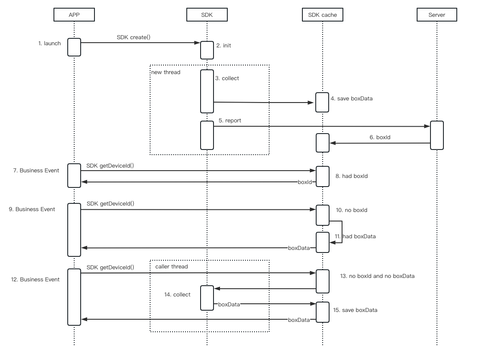

ishumei SDK（namely  'smsdk'）minSdkVersion is 14.

## 1 Project Cofnig

This chapter is the Android Studio project configuration steps. Other IDE developers, such as IntelliJ IDEA, Eclipse, etc., need to convert according to the description in this section. For cross-platform configuration, such as Flutter, uniapp, unity3d, etc., you can add plug-ins for access by yourself, or contact us to provide corresponding plug-in demos.

1. Copy `smsdk*.aar` to the libs directory of Module (such as app module)

2. Add reference in build.gradle

   ```groovy
   android {
     ……
     defaultConfig {
       ……
       ndk {
         // Select the ABI you actually need
         abiFilters 'armeabi', 'armeabi-v7a', 'arm64-v8a', 'x86', 'x86_64' 
       }
     }
   }
   
   dependencies {
     implementation fileTree(dir: "libs", include: ["smsdk*.aar"])
     ...
   }
   ```

3. To declare permissions, add the following permissions in AndroidManifest.xml

   ```xml
   <!-- required permissions -->
   <uses-permission android:name="android.permission.INTERNET" />
   <uses-permission android:name="android.permission.ACCESS_NETWORK_STATE"/>
   
   <!-- optional permissions -->
   <uses-permission android:name="android.permission.ACCESS_COARSE_LOCATION" />
   <uses-permission android:name="android.permission.ACCESS_FINE_LOCATION" />
   <uses-permission android:name="android.permission.ACCESS_WIFI_STATE" />
   <uses-permission android:name="android.permission.WRITE_EXTERNAL_STORAGE" />
   <uses-permission android:name="android.permission.READ_EXTERNAL_STORAGE"/>
   ```

   permission infomation

   | name                              | Instructions for use                                         |
   | --------------------------------- | ------------------------------------------------------------ |
   | INTERNET (required)               | Send the collected data to the server through the network    |
   | ACCESS_NETWORK_STATE (required)   | Determine whether the network is connected;<br/>Get network (network connection status) information, such as 2g, 3g, 4g, wifi, etc., operator information |
   | ACCESS_COARSE_LOCATION (optional) | Get location information                                     |
   | ACCESS_FINE_LOCATION (optional)   | Get location information                                     |
   | ACCESS_WIFI_STATE (optional)      | Get bssid, ssid information                                  |
   | WRITE_EXTERNAL_STORAGE (optional) | Save smsdk cached infomation                                 |
   | READ_EXTERNAL_STORAGE (optional)  | Restore smsdk cached information                             |

4. proguard config

   Add smsdk anti-obfuscation rules to the proguard-rules.pro file, as follows
   
   ```sh
   -keep class com.ishumei.** {*;}
   ```
   

## 2 Standard Embedded Mode

When the initialization method is called, data collection will be performed immediately, so the developer needs to ensure that the `create` method is called after "ACCEPT" to the privacy policy

```java
// Initialize parameter object
SmAntiFraud.SmOption option = new SmAntiFraud.SmOption();
// Required, Organization ID
option.setOrganization("YOUR_ORGANIZATION");
// Required, application ID, log in to Sumei background application management to view, if there is no suitable value, you can write "default"
option.setAppId("YOUR_APP_ID"); 
// Required, encrypted KEY, android_public_key attachment content in the email
option.setPublicKey("YOUR_PUBLICK_KEY"); 

// Initialization
boolean isOk = SmAntiFraud.create(context, option);
```

When calling the `create` method, smsdk will check whether the incoming parameters are legal. If the return value is `false`, you need to filter the `Smlog` in the logcat log for self-checking. Note that the version before smsdk 3.3.0 has no return value.

Timing of `create` method call

1. Call `create` method after accepted to the privacy policy
2. Only call `create` method in the main process

The `create` method takes about 1 second to collect data (low-end models may exceed 2 seconds), and the collection process occurs in a sub-thread without blocking the current thread. After normal initialization, you can call `SmAntiFraud.getDeviceId` to get the ID.

Timing of `getDeviceId` method call

1. Called after the `create` method returns `true`
2. Used when business events need to be reported, such as reporting the string returned by `getDeviceId` in key events such as login and registration

Some developers put `getDeviceId` in the header of all network requests. This will cause some problems, and developers need to cooperate to deal with them. The reasons and solutions will be explained with reference to the smsdk sequence diagram



Scenario 1: After initialization, there is `boxId` in `smsdk` cache, as shown in `7. Business Event`, calling `getDeviceId` at this time will return `boxId` immediately, and `boxId` can be directly placed in the `Header` of the business request. This scenario usually occurs during initialization, `smsdk` has completed a service interaction, obtained `boxId` from the server and successfully cached it.

Scenario 2: After initialization, there is no `boxId` but `boxData` in `smsdk` cache, as shown in `9. Business Event`, at this time calling `getDeviceId` will immediately return `boxData`, because `boxData` is too long, store it directly The `4K` limit may appear in the `Header` of the business request, causing `boxData` to be truncated. This scenario generally occurs during initialization. After `smsdk` collection is completed, `boxData` is generated, but a service interaction has not been completed, and `boxData` cannot be updated to `boxId`.

Scenario 3: After initialization, there is no `boxId` and no `boxData` in `smsdk` cache, as shown in `12. Business Event` in the figure. Calling the `getDeviceId` method at this time will wait for the collection to complete, and encrypt the collected data to generate `boxData` and return it. The waiting time is related to the collection speed and the timing of `create`. Assuming that the collection takes 2 seconds, if you call `create` immediately Call `getDeviceId`, then the `getDeviceId` method will block the current thread for 2 seconds; if you call the `getDeviceId` method after calling `create` 1 second, `getDeviceId` will block the current thread for 1 second, developers need to ensure that it will not be caused by blocking `ANR`. There is also the problem of `boxData` being truncated here. This scenario generally occurs after initialization, and the `getDeviceId` method is called when there is no `boxId` in `smsdk` cache and `smsdk` is collecting.

Solution to the `boxData` truncation problem described in Scenario 2 and Scenario 3: Communicate with the business-side developer and adjust the length limit of the `Header` of the business request. It is recommended to adjust the size to `24KB`; if the business side cannot be modified, you can configure `smsdk` to adjust the length of `boxData`, this method will reduce the security of `boxData`, please execute it as an alternative

```java
option.usingShortBoxData(true); 
```

Solution to the blocking problem described in Scenario 3: Do not call the `getDeviceId` method immediately during initialization. It is recommended to delay the call for 1 to 2 seconds. If you need to call it at the earliest opportunity, you can use the callback method to monitor `boxId`

```java
// This method must be called before the create method, otherwise there may be a problem of not triggering the callback
SmAntiFraud.registerServerIdCallback(new SmAntiFraud.IServerSmidCallback() {
  @Override
  public void onSuccess(String boxId) {
    // The server delivered successfully or the boxId is available in the cache
    // If the boxId exists in the cache, this method will be triggered 2 times, and the 2nd time will update the boxId in the cache
  }

  @Override
  public void onError(int errCode) {
    // -1: No network, common cause: the device has no network
		// -2: Network exception, network connection exception (conn.getResponseCode() throws an exception) or http status is not 200, common cause: proxy or privatization server configuration error
		// -3: The business is abnormal, the issued business status code is not 1100, and the server does not return deviceId. Common reasons: parameter configuration error, qps exceeding the limit, server exception
  }
});
```

`boxId` and `boxData` cannot be directly used as device identifiers, but `boxId` or `boxData` can be used to directly query device risks. See the chapter "Decryption of Server Access Device Fingerprint Identification" to learn how to obtain the plaintext device identification.

So far, the standard access part of `smsdk` has been completed. If there is no customization requirement, the access has been completed at this time. It is recommended to refer to the "Test" section to check whether the access is successful.

Overseas standard access (due to data compliance requirements, all overseas access needs to use the proxy mode, here is for special customers who cannot provide proxy services), you need to use the overseas SDK, and set the server address, the settings are as follows

1. Application business servers in Europe and the United States

   ```java
   // Users are distributed in Europe and America
   option.setArea(SmAntiFraud.AREA_FJNY);
   // If the user distribution range is global, the acceleration function needs to be enabled, and the configuration is as follows
   // option.setArea(SmAntiFraud.AREA_FJNY);
   // String host = "http://fp-na-it-acc.fengkongcloud.com";
   // option.setUrl(host + "/deviceprofile/v4");
   // option.setConfUrl(host + "/v3/cloudconf");
   ```

2. Application business servers in Europe and the United States (Frankfurt)

   ```java
   option.setArea("flkf");
   String host = "http://api-device-eur.fengkongcloud.com";
   option.setUrl(host + "/deviceprofile/v4");
   option.setConfUrl(host + "/v3/cloudconf");
   ```

3. Application business servers in Southeast Asia (Singapore)

   ```java
   // Users are distributed in Southeast Asia
   option.setArea(SmAntiFraud.AREA_XJP)
   // If the user distribution range is global, the acceleration function needs to be enabled, and the configuration is as follows
   // option.setArea(SmAntiFraud.AREA_XJP);
   // String host = "http://fp-sa-it-acc.fengkongcloud.com";
   // option.setUrl(host + "/deviceprofile/v4");
   // option.setConfUrl(host + "/v3/cloudconf");
   ```

## 3 Private Embedded Mode

The main steps are similar to **Standard Embedded Mode**, and the following configuration needs to be added

```java
// Set area, this value is organization ID
option.setArea("YOUR-ORGANIZATION");
// To set a private address, replace private-host with the privatized hostname (domain name)
String host = "https://private-host"; 
option.setUrl(host + "/deviceprofile/v4"); // Example path. Consistent with the production environment deployment server
option.setConfUrl(host + "/v3/cloudconf"); // Example path. Consistent with the production environment deployment server
```

Note, if the incoming `host` is an `http` request, such as `http://private-host`, you need to ensure that the APP can send `http` requests. After the embedded is completed, a self-test inspection is required according to the "Test" chapter.

## 4 Proxy Embedded Mode

The main steps are similar to **Standard Embedded Mode**, and the following configuration needs to be added

```java
// Replace host with the hostname (domain name) of the proxy server
String host = "https://proxy-host";
option.setUrl(host + "/deviceprofile/v4"); // Example path. Consistent with the production environment deployment server
option.setConfUrl(host + "/v3/cloudconf"); // Example path. Consistent with the production environment deployment server
```

Developers need to set up a proxy server by themselves. For related processing of the proxy server, refer to the "Server Access Proxy Access" chapter.

## 5 Test

1. Call the `SmAntiFraud.create(context, option)` method to get the return value `true`
2. The return value of calling `SmAntiFraud.getDeviceId()` method is `boxId`, like `Bm21V93t5QwTNdwyQxxxxxRYuSnOuwwylqZvz8Lixxxxx17lRMqcQ1jz9RwN6qW31/Z0YYmxN8KQnrya9xxxxxx==`
3. Run `adb logcat | grep Smlog`, there is no abnormal output, if there is abnormal output, please modify it according to the prompt
4. Select "Equipment Risk Trend" from the backstage navigation bar of Sumei Management, find the "Equipment Details" section, and check whether there is data reporting (there may be a delay, generally no more than 30 minutes)
5. If you fail to pass the test, contact Sumei staff for investigation

## 6 SDK upgrade

This article applies to the upgrade of Android smsdk v2 to Android smsdk v3. smsdk v2 will stop maintenance on December 30, 2022. We hope that customers who have already connected can switch to smsdk v3 as soon as possible.

Upgrade steps and precautions

1. To delete the old version `smsdk`, please locate the `smsdk` package according to the location of the `SmAntiFraud` class and delete it. If the project contains the `libsmsdk.so` dynamic library, it needs to be deleted together
2. Access the new version `smsdk` according to the steps in **Project Config**
3. Some APIs are deleted in the new version. After the package is replaced, the compilation fails. Just delete the `smsdk` error reporting method
4. Run the new `smsdk`, and perform a self-test according to the "TEST" chapter. If it fails, please modify it according to the error message or contact Sumei staff for troubleshooting
5. Proxy Embedded Mode customers need to upgrade the proxy server according to the "Server Access - Proxy Access" chapter
6. For Private Embedded Mode customers, you need to contact Sumei staff for an overall upgrade