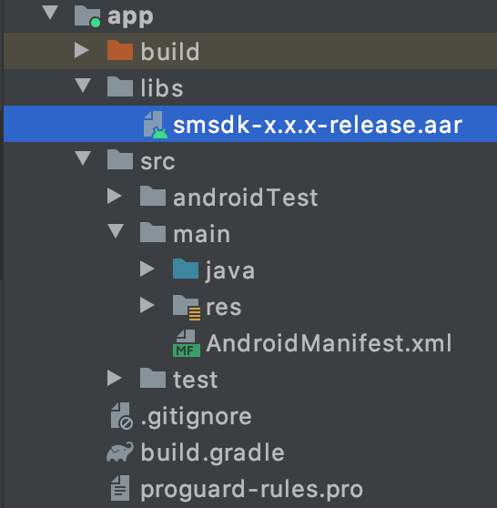

# android 设备指纹SDK接入步骤

如果接入过旧版数美SDK，请将旧版SDK的smsdk.jar和libsmsdk.so全部从项目中移除，避免发生旧版SDK干扰新版SDK问题。

1. **导入aar包**

   1. 将smsdk-x.x.x-release.aar拷贝到Module的libs目录下，如下图所示：

      

   2. 在build.gradle中增加依赖配置，配置如下所示：
 ```groovy
 android {
     // ……
     defaultConfig {
         // ……
         ndk {
             // 选择实际需要的cpu架构
             abiFilters 'armeabi', 'armeabi-v7a', 'arm64-v8a', 'x86', 'x86_64' 
         }
     }
 }

 dependencies {
     implementation fileTree(dir: 'libs', include: ['*.jar', smsdk-x.x.x-release.aar'])
     // ...
 }
 ```

2. **添加权限**

   在AndroidManifest.xml中添加如下权限：
```xml
<!-- 必选权限 -->
<uses-permission android:name="android.permission.INTERNET" />
<uses-permission android:name="android.permission.ACCESS_NETWORK_STATE"/>

<!-- 强烈建议权限 -->
<uses-permission android:name="android.permission.ACCESS_COARSE_LOCATION" />
<uses-permission android:name="android.permission.ACCESS_FINE_LOCATION" />
<uses-permission android:name="android.permission.ACCESS_WIFI_STATE" />
<uses-permission android:name="android.permission.WRITE_EXTERNAL_STORAGE" />
<uses-permission android:name="android.permission.READ_EXTERNAL_STORAGE"/>
<uses-permission android:name="android.permission.READ_PHONE_STATE" />
```

targetSdkVersion大于等于28时， 需在AndroidManifest.xml中增加如下配置：

```xml
<application
    ......
    android:usesCleartextTraffic="true"
    ......>
......
</application>
```

   如果项目有设置android:networkSecurityConfig选项，上面配置会失败，所以需要在对应XML中增加如下配置： 

```xml
<network-security-config>
   <domain-config cleartextTrafficPermitted="true">
      <!-- fengkongcloud.com 为默认值，如果通过 option.setUtl 设置的url 为 http 连接（下小节将介绍），需要将此 url，如 proxy.example.com 添加到 domain-config 中 -->
      <domain includeSubdomains="true">fengkongcloud.com</domain>
   </domain-config>
</network-security-config>
```

3. **代码防混淆**

   `proguard-rules.pro` 混淆规则文件中添加如下规则

```txt
-keep class com.ishumei.** {*;}
```

4. **初始化SDK**

   1. getDeviceId调用时机

      SmAntiFraud.getDeviceId() 接口在真正需要DeviceId时再进行调用。

      不要在create后立即调用此方法，不需要缓存调用getDeviceId的结果，deviceId在sdk内部会做缓存和更新处理。

   2. 初始化代码如下所示：
```java
String getCurProcessName(Context context) {
    int pid = android.os.Process.myPid();
    ActivityManager mActivityManager = (ActivityManager) context
            .getSystemService(Context.ACTIVITY_SERVICE);
    for (ActivityManager.RunningAppProcessInfo appProcess : mActivityManager
            .getRunningAppProcesses()) {
        if (appProcess.pid == pid) {
            return appProcess.processName;
        }
    }
    return null;
}
      
// 如果AndroidManifest.xml中没有指定主进程名字，主进程名默认与packagename相同
// 如下条件判断保证只在主进程中初始化SDK
if (getPackageName().equals(getCurProcessName(context))) {
    SmAntiFraud.SmOption option = new SmAntiFraud.SmOption();

    // 1 通用配置项
    option.setOrganization("YOUR_ORGANIZATION");//必填，组织标识，邮件中 organization 项
    option.setEncryptVer(SmAntiFraud.EncryptVer.V3); //SDK高于3.1.0版本，必填
    option.setAppId("YOUR_APP_ID"); //必填，应用标识，登录数美后台应用管理查看，没有合适值，可以写 default
    option.setPublicKey("YOUR_PUBLICK_KEY"); //必填，加密 KEY，邮件中 android_public_key 附件内容

    // 2 连接机房特殊配置项
    //
    // 2.1业务机房在国内
    //        1) 用户分布：中国（默认设置）
    // option.setArea(SmAntiFraud.AREA_BJ);
    //        2) 用户分布：全球
    // option.setArea(SmAntiFraud.AREA_BJ);
    // 注意，此处 host 必须添加协议头，下同。
    // String host = "http://fp-it-acc.fengkongcloud.com";
    // option.setUrl(host + "/deviceprofile/v4");
    // option.setConfUrl(host + "/v3/cloudconf");
    //
    // 2.2业务机房在欧美（弗吉尼亚机房）
    //        1) 用户分布：欧美
    // option.setArea(SmAntiFraud.AREA_FJNY);
    //        2) 用户分布：全球
    // option.setArea(SmAntiFraud.AREA_FJNY);
    // String host = "http://fp-na-it-acc.fengkongcloud.com";
    // option.setUrl(host + "/deviceprofile/v4");
    // option.setConfUrl(host + "/v3/cloudconf");
    //
    // 2.3业务机房在欧美（法兰克福机房）
    // option.setArea("flkf");
    // String host = "http://api-device-eur.fengkongcloud.com";
    // option.setUrl(host + "/deviceprofile/v4");
    // option.setConfUrl(host + "/v3/cloudconf");
    //
    // 2.4业务机房在东南亚
    //        1) 用户分布：东南亚
    // option.setArea(SmAntiFraud.AREA_XJP)
    //        2) 用户分布：全球
    // option.setArea(SmAntiFraud.AREA_XJP);
    // String host = "http://fp-sa-it-acc.fengkongcloud.com";
    // option.setUrl(host + "/deviceprofile/v4");
    // option.setConfUrl(host + "/v3/cloudconf");


    // 2.5 私有化特殊配置
    //        1) 设置 area
    // option.setArea("xxxxxx");  //  必填，组织标识，邮件中organization项
    //        2) 设置私有地址
    // String host = "https://private-host"; // 将 private-host 替换为您自己的主机名（域名）
    // option.setUrl(host + "/deviceprofile/v4");
    // option.setConfUrl(host + "/v3/cloudconf");

    // 3 SDK初始化
    SmAntiFraud.create(context, option);

    // 4.获取设备标识，注意获取到的是boxId，这个接口在需要使用deviceId时地方调用，
    // 会有极少情况出现 boxData 的情况，boxData 为加密后的采集数据，长度大约 8KB
    String deviceId = SmAntiFraud.getDeviceId();
}  
```

5. **SDK初始化时机**

   安装后首次启动时，在用户同意隐私协议后，立即初始化SDK。避免出现用户未同意隐私协议已经采集数据问题；如需授权，需要在授权结束时（无论用户是否同意授权）再初始化 SDK。

   后继启动时，应在启动后立即初始化SDK。

6. **getDeviceId调用时机**

   SmAntiFraud.getDeviceId()接口在真正需要DeviceId时再进行调用。

   不要缓存调用getDeviceId的结果，deviceId在sdk内部会做缓存和更新处理。在create后至少需要 2s 以上间隔再调用 getDeviceId() 方法，如果需要调用 SmAntiFraud.create(ctx, option) 后立即获取设备标识，请使用回调方法获取：

```java
SmAntiFraud.registerServerIdCallback(new SmAntiFraud.IServerSmidCallback() {
    @Override
    public void onSuccess(String deviceId) {
        // 服务器下发成功或缓存中有可用 deviceId
        // 可能会触发两次
    }

    @Override
    public void onError(int errorCode) {
        // errorCode 含义
        // -1: ERROR_NO_NETWORK，无网络（检查网络是否正常连接）
        // -2: ERROR_NO_RESPONSE，服务器无响应（检查接入是否有问题）
        // -3: ERROR_SERVER_RESPONSE，服务器响应错误（检查配置是否填写正确）
    }
});
```

7. **生命周期控制**

   接入的时候保证SmAntiFraud.create只在主进程调用一次。所以需要在调用前判断当前进程是否是主进程而不是其他 如 :push 或 ：ipc等后台服务进程。防止重复初始化。
