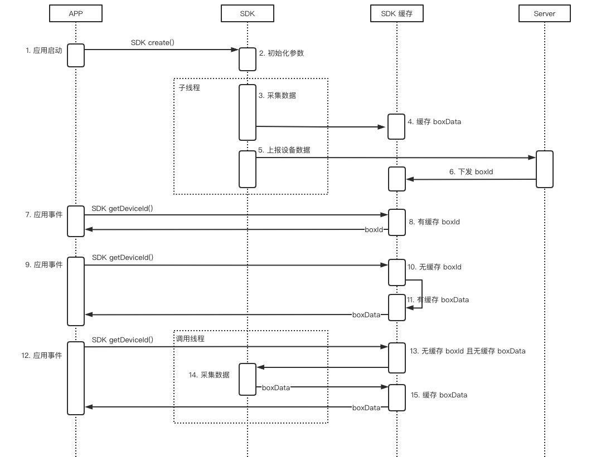

数美设备指纹 SDK（即 'smsdk'）最低支持 API Level 14。

## 1 工程配置

本章节为 Android Studio 工程配置步骤，其他 IDE 开发者，如 IntelliJ IDEA、Eclipse 等，需要自行根据本节描述进行转换。跨平台配置，如 Flutter、uniapp、unity3d 等，可以自行增加插件进行接入，也可以联系我们提供对应插件 Demo。

1. 将 smsdk*.aar 拷贝到 Module（例如 app 模块） 的 libs 目录下

2. 在 build.gradle 添加 aar 引用

   ```groovy
   android {
     ……
     defaultConfig {
       ……
       ndk {
         // 选择实际需要的 cpu 架构
         abiFilters 'armeabi', 'armeabi-v7a', 'arm64-v8a', 'x86', 'x86_64' 
       }
     }
   }
   
   dependencies {
     implementation fileTree(dir: "libs", include: ["smsdk*.aar"])
     ...
   }
   ```

3. 声明权限，在 AndroidManifest.xml 中添加如下权限

   ```xml
   <!-- 必选权限 -->
   <uses-permission android:name="android.permission.INTERNET" />
   <uses-permission android:name="android.permission.ACCESS_NETWORK_STATE"/>
   
   <!-- 强烈建议权限 -->
   <uses-permission android:name="android.permission.ACCESS_COARSE_LOCATION" />
   <uses-permission android:name="android.permission.ACCESS_FINE_LOCATION" />
   <uses-permission android:name="android.permission.ACCESS_WIFI_STATE" />
   <uses-permission android:name="android.permission.WRITE_EXTERNAL_STORAGE" />
   <uses-permission android:name="android.permission.READ_EXTERNAL_STORAGE"/>
   ```

   权限作用

   | 权限                         | 作用                                                         |
   | ---------------------------- | ------------------------------------------------------------ |
   | INTERNET（必选）             | 将采集数据通过网络发送到服务器                               |
   | ACCESS_NETWORK_STATE（必选） | 判断网络是否连接；<br/>获取 network （网络连接状态）信息，如 2g, 3g, 4g, wifi 等，运营商信息 |
   | ACCESS_COARSE_LOCATION       | 获取 cell （基站）信息                                       |
   | ACCESS_FINE_LOCATION         | 获取 cell （基站）信息                                       |
   | ACCESS_WIFI_STATE            | 获取 bssid（wifi mac）, ssid 信息                            |
   | WRITE_EXTERNAL_STORAGE       | 写入 SD 卡数美设备标识                                       |
   | READ_EXTERNAL_STORAGE        | 读取存储在 SD 卡中的数美设备标识                             |

4. http 设置，smsdk 默认使用 http 请求，在 targetSdkVersion > 27 时， 需在 AndroidManifest.xml 中增加如下配置

   ```xml
   <application
   	......
   	android:usesCleartextTraffic="true"
   	......
   >
   ......
   </application>
   ```

   如果 `application` 节点有设置 `android:networkSecurityConfig` 属性，如

   ```xml
   <application
   	......
   	android:usesCleartextTraffic="true"
   	android:networkSecurityConfig="@xml/network_security_config"
   	......>
   ......
   </application>
   ```

   则需要向 `xml/network_security_config.xml` 文件中添加 smsdk 域名配置（代理或私有化模式需要添加对应域名）

   ```xml
   <?xml version="1.0" encoding="utf-8"?>
   <network-security-config>
       <!-- smsdk 域名配置 -->
       <domain-config cleartextTrafficPermitted="true">
           <domain includeSubdomains="true">fengkongcloud.com</domain>
       </domain-config>
   </network-security-config>
   ```

5. 添加 smsdk 隔离进程服务声明

   ```xml
   <application
   	......>
   	<service
   		android:name="com.ishumei.smantifraud.IServiceImp"
   		android:isolatedProcess="true" />
   </application>
   ```

   服务用于检测 Magisk 工具，为避免 Application 中代码引起隔离进程异常导致检测失效，需要对隔离进程做绕过处理，参考 ”常见问题  Android 如何判断隔离进程“，如果此配置与 APP 其他配置冲突，可移除此服务声明。注意，smsdk 3.3.0 之前版本不需要此配置。

6. 代码放混淆

   向 proguard-rules.pro 文件中添加 smsdk 防混淆规则，如下

   ```sh
   -keep class com.ishumei.** {*;}
   ```

## 2 标准接入

最简初始化，初始化成功后，会立即进行数据采集，所以需要开发者确保在 ”同意“ 隐私政策前 **不要** 调用 `create` 方法。

```java
// 初始化参数对象
SmAntiFraud.SmOption option = new SmAntiFraud.SmOption();
// 必填，组织标识
option.setOrganization("YOUR_ORGANIZATION");
// 必填，应用标识，登录数美后台应用管理查看，没有合适值，可以写 "default"
option.setAppId("YOUR_APP_ID"); 
// 必填，加密 KEY，邮件中 android_public_key 附件内容
option.setPublicKey("YOUR_PUBLICK_KEY"); 

// 初始化
boolean isOk = SmAntiFraud.create(context, option);
```

调用 `create` 方法时，smsdk 会检查传入参数是否合法，如果返回值为 `false`，则需要过滤 logcat 日志中的 `Smlog` 进行自检，注意 smsdk 3.3.0 之前版本没有返回值。

初始化调用时机

1. APP 首次启动，同意隐私政策后调用
2. APP 非首次启动，且同意了隐私政策，启动时调用
3. 只在 **主进程** 中调用，避免多进程导致频繁采集问题，参考 "常见问题 Android 如何判断主进程" 章节

`create` 方法采集数据大约需要 1 秒（低端机型会出现超出 2 秒情况），采集过程发生在子线程，不会阻塞当前线程。正常初始化后，可调用 `SmAntiFraud.getDeviceId` 获取标识。

获取标识时机：

1. 在 `create` 方法返回 `true` 后调用（返回 `false` 时调用 `getDeviceId` 方法同样有 boxData 返回，但此 boxData 无法转换成设备标识）
2. 在需要上报业务事件时使用，比如登录、注册等关键事件中上报 `getDeviceId` 返回的字符串

部分开发者将 `getDeviceId` 放到所有网络请求的 Header 中，这样做会出现一些问题，需要开发者配合处理，原因及方案将参照 smsdk 时序图进行说明



场景一：初始化后，smsdk 缓存中有 boxId，如图 ”7. 应用事件“，此时调用 `getDeviceId` 会立即返回 boxId，可以将 boxId 直接放到业务请求 Header 中。此场景一般出现在初始化时，smsdk 已经完成过一次服务交互，从服务器获取到 boxId 并缓存成功。

场景二：初始化后，smsdk 缓存中没有 boxId 但是有 boxData，如图 ”9. 应用事件“，此时调用 `getDeviceId` 会立即返回 boxData，由于 boxData 长度较长，直接存放在业务请求 Header 中可能会出现 4K 限制，导致 boxData 被截断，处理方案见下文。此场景一般出现在初始化时，smsdk 采集完成后，生成 boxData，但是未完成一次服务交互，未能将 boxData 更新为 boxId。

场景三：初始化后，smsdk  缓存中没有 boxId 且没有 boxData，如图中 "12. 应用事件"。此时调用 `getDeviceId` 方法会等待采集完成，并将采集数据加密生成 boxData 返回，等待过程与采集速度和`create`时机有关，假设采集耗时为 2 秒，若调用 `create` 后立即调用 `getDeviceId`，那么 `getDeviceId` 方法会阻塞当前线程 2 秒；若调用 `create`  1 秒后调用 `getDeviceId` 方法，`getDeviceId` 会阻塞当前线程 1 秒，需要开发者确保不会由于阻塞造成 ANR。此处同样有 boxData 被截断的问题。此场景一般出现在初始化后，smsdk 缓存中没有 boxId 且 smsdk 正在采集中时调用 `getDeviceId` 方法。

场景二和场景三所述 boxData 截断问题解决方案：与业务端同学协调，调整业务请求 Header 长度限制，建议调整到 24KB 大小；如果业务侧无法修改可以通过配置 smsdk 进行 boxData 长度调整，此方法会降低 boxData 安全性，请作为备选方案执行

```java
option.usingShortBoxData(true); 
```

场景三中所述阻塞问题解决方案：不要在初始化时立即调用 `getDeviceId` 方法，建议延迟 1 到 2 秒调用，如果需要在最早时机调用，可以使用回调方式监听 boxId

```java
// 此方法必须在 create 方法之前调用，否则可能会出现不触发回调问题
SmAntiFraud.registerServerIdCallback(new SmAntiFraud.IServerSmidCallback() {
  @Override
  public void onSuccess(String boxId) {
    // 服务器下发成功或缓存中有可用 boxId
    // 如果缓存中存在 boxId，此方法会触发 2 次，第 2 次会更新缓存中的 boxId
  }

  @Override
  public void onError(int errCode) {
    // -1：无网络，常见原因：设备无网络
		// -2：网络异常，网络连接异常（conn.getResponseCode() 抛出异常）或者 http 状态非 200，常见原因：代理或私有化服务器配置错误
		// -3：业务异常，下发业务状态码非 1100，服务器未返回 deviceId，常见原因：参数配置错误、qps 超限、服务器异常
  }
});
```

boxId 与 boxData 无法直接当做设备标识，但是可以使用 boxId 或 boxData 直接查询设备风险。查看 ”服务器接入 设备指纹标识解密“ 章节，了解如何获取明文设备标识。

至此 smsdk 国内标准接入部分已经全部完成，如果没有定制化需求，此时已经接入完毕，建议参考 "测试" 章节自查是否接入成功。

海外标准接入（由于数据合规要求，所有海外接入都需要走代理模式，此处为无法提供代理服务的特殊客户使用），需要使用海外专用包，并切换设备指纹机房，设置如下

1. 业务机房在欧美（弗吉尼亚机房）

   ```java
   // 用户分布范围为欧美
   option.setArea(SmAntiFraud.AREA_FJNY);
   // 用户分布范围为全球，则需要开启加速功能，配置如下
   // option.setArea(SmAntiFraud.AREA_FJNY);
   // String host = "http://fp-na-it-acc.fengkongcloud.com";
   // option.setUrl(host + "/deviceprofile/v4");
   // option.setConfUrl(host + "/v3/cloudconf");
   ```

2. 业务机房在欧美（法兰克福机房）

   ```java
   option.setArea("flkf");
   String host = "http://api-device-eur.fengkongcloud.com";
   option.setUrl(host + "/deviceprofile/v4");
   option.setConfUrl(host + "/v3/cloudconf");
   ```

3. 业务机房在东南亚（新加坡机房）

   ```java
   // 用户分布范围为东南亚
   option.setArea(SmAntiFraud.AREA_XJP)
   // 用户分布范围为全球，则需要开启加速功能，配置如下
   // option.setArea(SmAntiFraud.AREA_XJP);
   // String host = "http://fp-sa-it-acc.fengkongcloud.com";
   // option.setUrl(host + "/deviceprofile/v4");
   // option.setConfUrl(host + "/v3/cloudconf");
   ```

由于检测机构或者应用市场对隐私政策解读不一致，导致部分字段在某些检测中被标记为风险字段，因为无法确切确定这些字段属于数据违规字段，且数美有相关策略使用到这些字段，所以将这些字段采集与否权限已交给开发者，开发者可以通过 "常见问题 Android 屏蔽采集部分字段" 章节屏蔽字段。

## 3 私有化接入

主要步骤与标准接入类似，需要增加以下配置

```java
// 设置 area，此值为组织标识
option.setArea("YOUR-ORGANIZATION");
// 设置私有地址，将 private-host 替换为私有化的主机名（域名）
String host = "https://private-host"; 
option.setUrl(host + "/deviceprofile/v4"); // 示例路径，需要与真实场景一致
option.setConfUrl(host + "/v3/cloudconf"); // 示例路径，需要与真实场景一致
```

注意，如果传入 host 为 http 请求，如 `http://private-host`，需要确保 APP 可以发送 http 请求，参考 "工程配置" 章节 http 设置部分。私有化接入完成后，需要根据 "测试" 章节进行自测检查。

## 4 代理接入

smsdk 端上逻辑设置与标准接入类似，需要增加以下配置

```java
// 设置私有地址，将 host 替换为代理服务器的主机名（域名）
String host = "https://proxy-host";
option.setUrl(host + "/deviceprofile/v4"); // 示例路径，需要与真实场景一致
option.setConfUrl(host + "/v3/cloudconf"); // 示例路径，需要与真实场景一致
```

开发者需要自行搭建代理服务器，代理服务器相关处理参考 ”服务器接入 代理接入“ 章节。

## 5 测试

1. 调用 `SmAntiFraud.create(context, option)` 方法获取返回值为 `true`
2. 调用 `SmAntiFraud.getDeviceId()` 方法返回值为 boxId，如 `Bm21V93t5QwTNdwyQxxxxxRYuSnOuwwylqZvz8Lixxxxx17lRMqcQ1jz9RwN6qW31/Z0YYmxN8KQnrya9xxxxxx==`
3. 执行 `adb logcat | grep Smlog` 无异常输出，若有异常输出，请根据提示修改
4. 通过数美管理后台导航栏选择 ”设备风险趋势"，找到 “设备详情” 部分，查看是否有数据上报（可能存在延时，一般不超过 30 分钟）
5. 无法通过测试时，联系数美工作人员进行排查

## 6 SDK 升级

本文适用于 Android smsdk v2 版本升级到 Android smsdk v3 版本，smsdk v2 将于 2022 年 12 月 30 日停止维护，希望已接入客户尽快切换到 smsdk v3 版本。

升级步骤及注意事项

1. 删除旧版本 smsdk，请根据 SmAntiFraud 类所在位置，定位 smsdk 包进行删除，如果项目中包含 `libsmsdk.so` 动态库，需要一并删除
2. 根据 ”Android SDK 工程配置“ 章节步骤接入新版本 smsdk
3. 新版本中删除了部分 API，替换包后，导致编译失败，直接将 smsdk 报错方法删除即可
4. 运行新 smsdk，根据 ”Android SDK 测试“ 章节进行自测，如果不成功，请根据错误提示进行修改或联系数美工作人员进行排查
5. 代理接入客户，需要根据 ”服务器接入 代理接入“ 章节进行代理服务器升级
6. 私有化接入客户，需要联系数美工作人员进行整体升级

smsdk v3 版本终端不再提供明文设备标识，业务端不可以将 boxId 或 boxData 直接当做标识，获取标识方法参考 ”服务器接入 设备指纹标识解密“。

smsdk v3 版本首次启动直接调用 `SmAntiFraud.getDeviceId` 方法会出现阻塞当前线程问题，解决方案查看 ”Android SDK 标准接入 场景三“ 小节。
