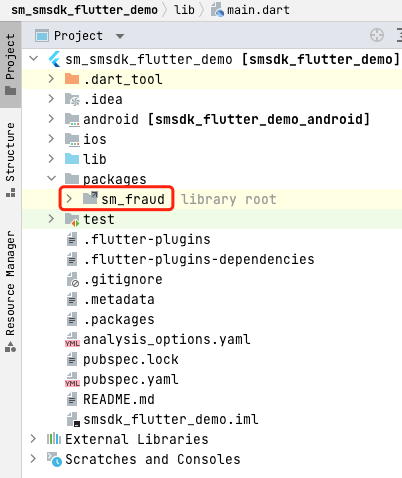

# ShuMei Flutter Plugin Integration Manual

ShuMei provides a plugin named sm_fraud, which includes native SDKs for both Android and iOS. Flutter can directly import and use the plugin. Plugin location: `sm_smsdk_flutter_demo/packages/sm_fraud`

## 1 Import ShuMei Plugin

Paste the plugin folder sm_fraud into the project directory (using sm_smsdk_flutter_demo as an example).
Create a packages folder (customizable) in the root directory of the project and move the plugin project into it. The directory structure after moving is as follows:



## 2 Add Dependency in pubspec.yaml

Open the project's pubspec.yaml and add the ShuMei plugin in dev_dependencies as follows:


## 3 Update Dependencies

Execute: `Flutter pub get` in the root directory of the Flutter project.

## 4 Start the SDK

When starting for the first time after installation, start the SDK immediately after the user agrees to the privacy policy to avoid collecting data before the user agrees to the privacy policy.

For subsequent app starts, the SDK should be started immediately after the app starts.

Refer to the example code in the `sm_smsdk_flutter_demo/lib/main.dart` file for method calls.

### 4.1 Import SDK in Dart

```dart
import 'package:sm_fraud/sm_fraud.dart';
```

### 4.2 Add Permissions and Configurations (Important)

1. iOS only requires network permissions. If using HTTP requests, configure [Allow Arbitrary Loads] in Info.plist according to Apple's ATS requirements, as described in Chapter 6.
2. For Android SDK code obfuscation, add the following rules in the proguard-rules.pro obfuscation rules file:

```
-keep class com.ishumei.** {*;}
```

3. Android requires permission configuration. Add the following permissions in AndroidManifest.xml:

```xml
<!-- Required permissions -->
<uses-permission android:name="android.permission.INTERNET" />
<uses-permission android:name="android.permission.ACCESS_NETWORK_STATE"/>

<!-- Strongly recommended permissions -->
<uses-permission android:name="android.permission.ACCESS_COARSE_LOCATION" />
<uses-permission android:name="android.permission.ACCESS_WIFI_STATE" />
<uses-permission android:name="android.permission.WRITE_EXTERNAL_STORAGE" />
<uses-permission android:name="android.permission.READ_EXTERNAL_STORAGE"/>
<uses-permission android:name="android.permission.READ_PHONE_STATE" />
```

### 4.3 Call the Plugin's Create Method to Start the SDK

The create method accepts a Map, with key values already defined in the SmFraud class. There are 3 required items, as follows:

```dart
SmFraud.create(optionDic: { 
  // Required, organization identifier, organization item in the email 
  SmFraud.OPTION_ORG: 'YOUR_ORGANIZATION', 

  // Required, application identifier, view in ShuMei backend application management, if no suitable value, you can write "default"
  SmFraud.OPTION_APPID: 'YOUR_APP_ID', 

  // Required, encryption KEY
  SmFraud.OPTION_PUBLICKEY_ANDROID: 'YOUR_ANDROID_PUBLICK_KEY', 
  // Required, encryption KEY
  SmFraud.OPTION_PUBLICKEY_IOS: 'YOUR_IOS_PUBLICK_KEY', 
  // Required for HarmonyOS App, encryption KEY
  SmFraud.OPTION_PUBLICKEY_HARMONY: 'YOUR_HARMONY_PUBLICK_KEY', 

  // Required for privatization or proxy: set device data upload address
  //SmFraud.OPTION_URL: 'YOUR_URL', 

  // Required for privatization or proxy: set cloud configuration request address
  //SmFraud.OPTION_CONFURL: 'YOUR_CONF_URL', 

  // Optional: whether to use https requests, default is not to use 
  //SmFraud.OPTION_USE_HTTPS: false,  
}); 
```

## 5 Get Device Identifier

Call the `SmFraud.getDeviceId()` interface when the DeviceId is truly needed.

Do not call this method immediately after create. There is no need to cache the result of calling getDeviceId, as the deviceId will be cached and updated internally by the SDK.

To call the ShuMei Plugin's API, call the getDeviceId method as follows:

```dart
SmFraud.getDeviceId().then((value) => { 
   Print('deviceid : ${value}');
}); 
```

## 6 Other Configurations and Instructions

### 6.1 HTTPS Settings

If not using HTTPS requests, according to Apple's ATS requirements, iOS needs to add the [Allow Arbitrary Loads] configuration in Info.plist to allow HTTP requests, with the following values:


### 6.2 Check if Integration is Successful

You can view the data uploaded by the SDK in the ShuMei management backend to confirm whether the integration is successful.

The ShuMei management backend is used to view access statistics and historical records of various services, and to perform service-related operations.

First, go to [www.fengkongcloud.com](http://www.fengkongcloud.com)

Then select the "Device Risk Trend" page in the left navigation bar, and you can view the devices reported by the SDK.

### 6.3 iOS Collection of IDFA

The iOS SDK collects IDFA by default (not collected in the overseas version). When submitting for app store review, if it is a version that collects IDFA, it needs to be stated that IDFA is collected.