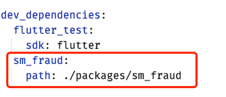

# 数美 Flutter Plugin 接入手册

数美提供的 plugin 名为 sm_fraud，其中包含 Android 和 iOS 的 native SDK，Flutter 可以直接导入 plugin 使用。

## 1 导入数美 plugin

将数美 plugin 项目文件夹 sm_fraud 粘贴到 app 项目中。
例如在 app 项目中建立 packages（可自定）文件夹，将 plugin 项目移至其中，移动后目录架构如下


## 2 在 pubspec.yaml 中添加依赖

打开项目的 pubspec.yaml，在 dev_dependencies 中添加数美 plugin 插件如下




## 3 更新依赖

在 Flutter 项目根目录下执行：`Flutter pub get`

## 4 初始化SDK

安装后首次启动时，在用户同意隐私协议后，立即初始化 SDK。避免出现用户未同意隐私协议已经采集数据问题。

后续启动时，应在启动后立即初始化 SDK。

### 4.1 在 dart 中 import SDK
```dart
import 'package:sm_fraud/sm_fraud.dart';
```

### 4.2 添加权限和配置（重要）

1. iOS 只需要连网权限，若使用 HTTP 请求，根据苹果对 ATS 的要求，参考第六章的说明1，配置 Info.plist 中的 [Allow Arbitrary Loads]。
2. Android SDK 的代码防混淆，在 proguard-rules.pro 混淆规则文件中添加如下规则：
```
-keep class com.ishumei.** {*;}
```
3. Android 需要配置权限，在 AndroidManifest.xml 中添加如下权限：
```xml
<!-- 必选权限 -->
<uses-permission android:name="android.permission.INTERNET" />
<uses-permission android:name="android.permission.ACCESS_NETWORK_STATE"/>

<!-- 强烈建议权限 -->
<uses-permission android:name="android.permission.ACCESS_COARSE_LOCATION" />
<uses-permission android:name="android.permission.ACCESS_WIFI_STATE" />
<uses-permission android:name="android.permission.WRITE_EXTERNAL_STORAGE" />
<uses-permission android:name="android.permission.READ_EXTERNAL_STORAGE"/>
<uses-permission android:name="android.permission.READ_PHONE_STATE" />
```

### 4.3 调用 plugin 的 create 方法初始化 SDK

create 方法接收一个 Map，Map 中的 key 值已经在 SmFraud 类中定义，其中必填项有 3 项， 如下
```dart
SmFraud.create(optionDic: { 
   //必填，组织标识，邮件中 organization 项 
   SmFraud.OPTION_ORG: 'YOUR_ORGANIZATION', 

   //必填，应用标识，登录数美后台应用管理查看，没有合适值，可以写 "default"
   SmFraud.OPTION_APPID: 'YOUR_APP_ID', 

   //必填，加密 KEY，邮件中 android_public_key 附件内容 
   SmFraud.OPTION_PUBLICKEY: 'YOUR_PUBLICK_KEY', 

   //私有化或代理时必填：设置设备数据上传地址
   //SmFraud.OPTION_URL: 'YOUR_URL', 

   //私有化或代理时必填：设置云配请求地址
   //SmFraud.OPTION_CONFURL: 'YOUR_CONF_URL', 

   //选填：是否使用https请求，默认不使用 
   //SmFraud.OPTION_USE_HTTPS: false,  
}); 
```

## 5 获取设备标识

SmFraud.getDeviceId() 接口在真正需要 DeviceId 时再进行调用。

不要在 create 后立即调用此方法，不需要缓存调用 getDeviceId 的结果，deviceId 在 sdk 内部会做缓存和更新处理。

调用数美 Plugin 的 API，调用 getDeviceId 方法，如下：

```dart
SmFraud.getDeviceId().then((value) => { 
   Print('deviceid : ${value}');
}); 
```


## 6 其他配置和说明

### 6.1 HTTPS 设置
若不使用 HTTPS 请求，根据苹果 ATS 要求，iOS 需在 Info.plist 中，新增 [Allow Arbitrary Loads] 配置，以允许 HTTP 请求，配置如下值


### 6.2 检查接入是否成功 

在数美管理后台可查看SDK上传的数据，通过检查上传数据，可确认接入是否成功。

数美管理后台用来查看各个服务的访问统计、历史记录，同时可进行服务相关的操作

首先，进入 [www.fengkongcloud.com](http://www.fengkongcloud.com)

接着在界面左侧导航栏选择”设备风险趋势”的“设备详情”页面，即可查看 SDK 上报的设备

### 6.3 ios 采集 IDFA 事项
iOS 的 SDK 默认采集了 IDFA（海外版本不采集），在提交 app store 审核时，若为采集 idfa 的版本，需要说明采集了 idfa。