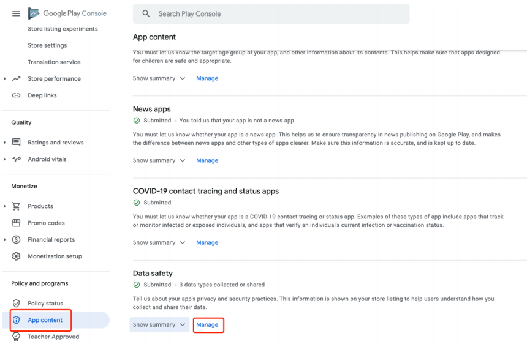
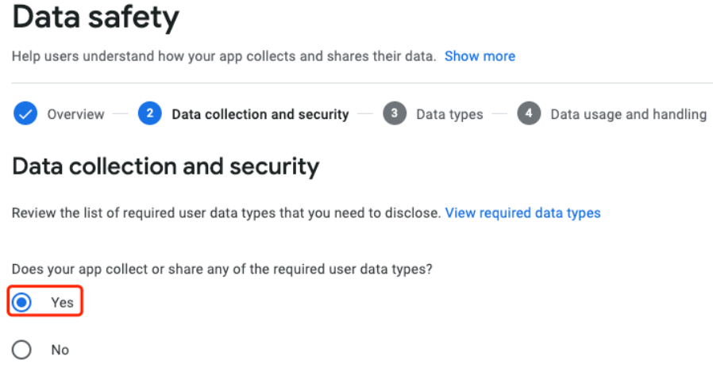
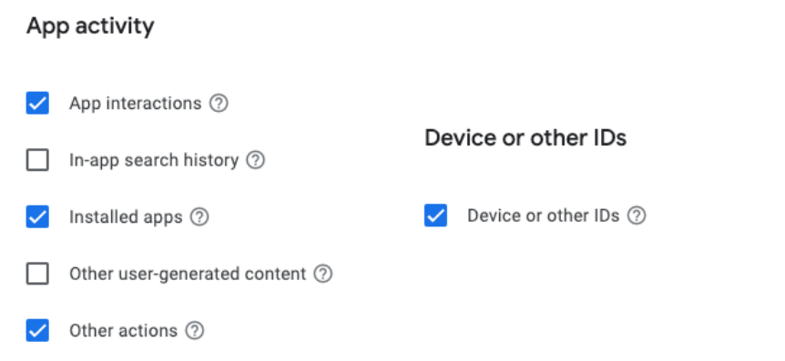
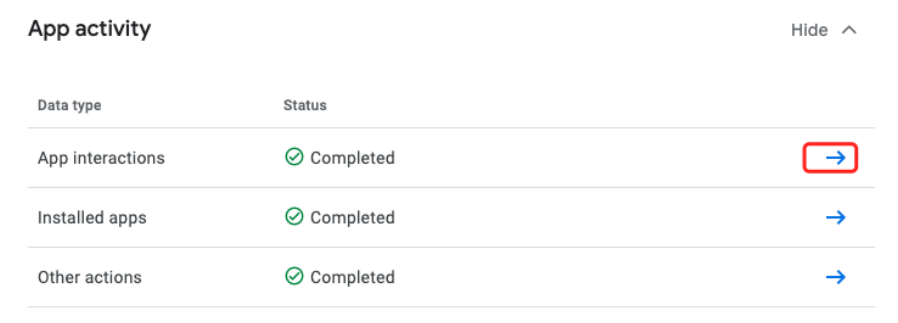
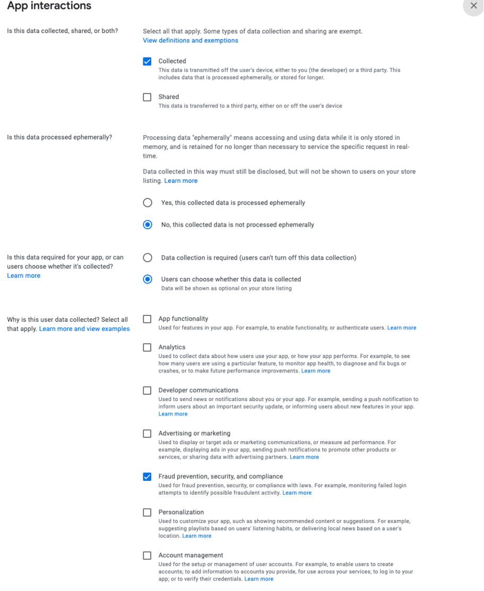
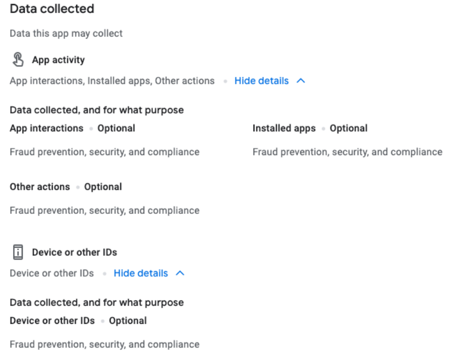

## 1 概述

​    2019 年 1 月，中央网信办、工信部、公安部、国家市场监督管理总局联合发布了《关于开展App违法违规收集使用个人信息专项整治的公告》，拉开了相关部门重拳整治移动App强制授权、过度索权、超范围收集个人信息，违规使用个人信息等乱象的大幕。上述专项整治活动开展以来，有众多 App 运营方因未能及时做出对应调整导致被公开通报甚至 App 被强制下架。    

​    为帮助使用数美 SDK 的 App 开发者和运营者更好地落实用户个人信息保护相关事宜，避免因涉及第三方 SDK 的业务而违反相关法律法规、政策及标准的规定，我方特发出此提示通知。贵方应按照相关法律法规的要求在《隐私政策》中的 “数据共享与披露” 等表述条款中增加数美 SDK 隐私声明，参考下文 “2 隐私协议声明” 章节。隐私协议声明适用全平台最新稳定版数美设备指纹 SDK，部分平台提供可选配置项，可以参考 “3 可控配置项” 章节对部数据段进行调整。

## 2 隐私协议声明

### 2.1 国内版

​    为了实现风险控制和欺诈识别的目的，进而保护您的账户和交易安全，我们的产品可能会集成第三方的 SDK 或类似应用程序，具体如下：

| SDK 名称 | 所属公司名称             | 所属端| SDK 收集数据的类型                                           | SDK 用途                                   | 隐私政策链接                                  |
| :--------:| ------------------------ | -|----------------------------------------------------------- | ------------------------------------------ | --------------------------------------------- |
| 数美 SDK（com.ishumei）| 北京数美时代科技有限公司 |移动端| 必要个人信息：<br />1. 设备基本信息，包括设备品牌、设备制造商、设备型号、设备名称、设备系统类型及版本信息、设备基本设置、设备环境；<br />2. 设备标识信息，包括Android ID、IDFV（应用开发商标识符）、IDFA（广告标示符）；<br />3. 设备网络信息，包括网络的接入形式、周边WIFI列表、网络运营商信息、网络连接状态；<br />4. 设备应用信息，包括SDK宿主应用包名及版本号、运行中进程信息（仅获取当前进程名称）。<br /><br />可选个人信息：MAC地址、软件列表、无线路由器标识（BSSID、SSID）及IP地址、粗略位置信息、精准位置信息、屏幕分辨率。 | 用于风险控制和反欺诈，以保障账户和交易安全 | https://www.ishumei.com/legal/cn/privacy.html |
| 数美 SDK（com.ishumei）         | 北京数美时代科技有限公司  |          小程序端             | 设备品牌、设备型号、WiFi列表、网络类型、连接WiFi信息、ip信息、canvas指纹、系统版本号、微信客户端版本号、SDK版本号 |   用于风险控制和反欺诈，以保障账户和交易安全   | https://www.ishumei.com/legal/cn/privacy.html  |
| 数美 SDK（com.ishumei）         | 北京数美时代科技有限公司  |          web端             | Canvas指纹、cookies信息、ua客户端浏览器信息 |   用于风险控制和反欺诈，以保障账户和交易安全   | https://www.ishumei.com/legal/cn/privacy.html  |


   贵方应对上述通知内容给予足够的**重视**，根据相关法律法规的要求及本通知的建议进一步完善贵方App中《隐私政策》的相关内容。若因贵方未能及时完善《隐私政策》相关内容导致贵方被公开通报甚至App被下架的，相关责任应由贵方**自主承担**。


### 2.2 海外版

**Privacy Advice for Shumei SDK**

We suggest that you should add the following contents to the relevant sections of your app's privacy policy, such as third-party information collection details, advertising or data analysis:

| Name of SDK | Purpose                           | Collected Information                                        | Requested Access                                             |
| ----------- | --------------------------------- | ------------------------------------------------------------ | ------------------------------------------------------------ |
| Shumei SDK  | Data statistics and Anti-cheating | (1) Basic equipment information, including equipment brand, equipment manufacturer, equipment model number, equipment name, equipment system type and version, equipment basic configuration, equipment basic settings, equipment environment;<br />(2) Device identification information,Android ID, IDFV (Identifier For Vendor), IDFA (Identity for Advertisers), OAID (Open Anonymous Device Identifier)<br />(3) Device network information, including network access form, wireless router identification (BSSID, SSID) and IP address, WIFI list, network operator information, network base station information, network connection status<br />(4) Device application information, including SDK host application package name and version number | **For Android**:<br />INTERNET<br />ACCESS_COARSE_LOCATION<br />READ/WRITE_EXTERNAL_STORAGE<br />ACCESS_NETWORK_STATE <br /><br />**For IOS:**<br />INTERNET |
|             |                                   |                                                              |                                                              |

如果收到 Google Play 对于 smsdk 的警告包含如下关键字： Installed application information ，可以通过以下步骤解决。

未收到警告的客户，可以暂不处理。收到其他警告需要反馈数美进⾏分析。

#### 2.2.1 APP 增加显著披露提示

[google 官方文档](https://support.google.com/googleplay/android-developer/answer/11150561#zippy=)

界面要求：

- 使用明确而友好的语言请求用户的明确许可，例如“同意”，而不是“允许访问”（听起来可能令人生畏，而且含糊不清）或“知道了”（太过随意）。
- 至少使用两个选项。第一个选项让用户可以授予权限。第二个选项让用户可以拒绝同意，但可在日后同意授权。使用“以后再说”或“跳过”，让您可以日后再次征求用户同意。
- 请勿使用与 Android 系统界面通知和请求类似的披露声明提示，因为这可能会使用户感到困惑。
- 考虑让披露声明提示背景颜色与应用的样式和主题相匹配，而不是采用白色，这样消费者就会认为此消息来自您的应用。
- 醒目披露声明可以是窗口提示，也可以是应用界面中用户流的一部分。例如，如果您有一个对话界面，则可以在对话界面中显示醒目的披露声明和征求用户同意文字，同时仍然满足 Play 管理中心的要求。
- 如果您日后需要再次征求用户同意，请注意考虑用户疲劳感。如果用户已多次在应用内拒绝同意，请尊重用户的选择。

具体操作如下所示。

##### APP 中存在披露提示

如果 APP 之前添加过 披露提示，则在其后增加 ishumei sdk 披露：

...YOUR DISCLOSURE...

In addition, our app collects **Installed application information** with ishuemi SDK, in order to fraud prevention, security, or compliance with laws. For example, monitor whether the device is in the root environment, whether there is a hook risk, and whether it is running on a real device, etc.

按钮：DENY & ACCEPT

点击 ACCEPT 时，启动SDK；点击 DENY 时，不要调⽤ smsdk 任何接⼝，相当于没有接⼊ smsdk。

##### APP 中没有披露提示

新增披露提示，显示时机是启动 smsdk 前，内容如下：（将 XXX 替换成 APP 名称）

XXX APP ishumei SDK collects **Installed application information** to used for fraud prevention, security, or compliance with laws. For example, monitor whether the device is in the root environment, whether there is a hook risk, and whether it is running on a real device, etc.

按钮：DENY & ACCEPT

点击 ACCEPT 时，启动SDK；点击 DENY 时，不要调⽤ smsdk 任何接⼝，相当于没有接⼊ smsdk。

#### 2.2.2 使用海外版 smsdk

海外版 smsdk 减少了部分采集数据，APP 上架 google play 时需要使用海外版本 smsdk。

#### 2.2.3 使用 https 请求

smsdk 默认是用 http 请求，需要主动调用 `smOption.setUsingHttps(true)` 方法切换 https 请求。如果是代理模式或者私有化模式接入，需要自行确保 url 请求为 https 请求，比如

```java
smOption.setUrl("YOUR-URL") // YOUR-URL 为 https 地址
smOption.setConfUrl("YOUR-URL") // YOUR-URL 为 https 地址
```

#### 2.2.4 更新 Data Safety 声明

进⼊ Google Play console，选中被警告应⽤，依次选中 Policy and programs -> App content -> Data safety -> 点击 Manager，如图：



Data collection and security 选择 yes，其它选项按照实际情况进⾏选择



选择完点击 "Next" 进⼊ Data types ⻚，App activity 和 Device or other IDs 做如下选择，其它按照实际情况选择



选择完，点击 "Next" 进⼊ Data usage and handling ⻚，对 App activity 进⾏配置



以下为 App interactions 最简选项，根据实际情况进⾏增加（Installed apps 、Other actions、Device or other IDs 选项处理⽅式与此相同）



填写完毕后，会进⼊ Preview ⻚⾯，检查是否存在问题，⾄少应该存在以下两项



点击 “Submit” 进⾏更新。

## 3 可控配置项

开发者可以参考如下 示例 部分对 SDK 数据采集项进行调整，此类方法在 APP 使用者同意了隐私政策，但是不希望上报某些信息时使用，完整的 SDK 接入方法参考各 SDK 接入文档。

### 3.1 Android 端

#### 示例

通过此方式屏蔽部分数据采集，此处以 oaid 为例，其他可控信息见：可控字段表

```java
// 详细接入过程参考 Android 接入文档
SmAntiFraud.SmOption option = new SmAntiFraud.SmOption();
... // 其它设置
// 
Set<String> notCollect = new HashSet<>();
notCollect.add("oaid"); // 标识不采集 oaid
option.setNotCollect(notCollect);
... // 其它设置
SmAntiFraud.create(context, option);
```

#### 可控字段表

传入不采集字段名必须与下表 **字段名** 一致（字母升序）

| 字段名            | 含义                        | 系统关键 API                                                 | 删除后影响                         |
| ----------------- | --------------------------- | ------------------------------------------------------------ | ---------------------------------- |
| adid              | android_id                  | Secure#getString(Resolver, ANDROID_ID)                       | 影响设备标识稳定性                 |
| bssid             | WIFI 热点的 MAC 地址        | WifiManager#getConnectionInfo<br />WifiInfo#getBSSID         | 影响风险设备聚集风险的识别         |
| cell              | 基站信息                    | TelephonyManager#getCellLocation<br />GsmCellLocation#getCid<br />GsmCellLocation#getLac | 影响风险设备聚集风险的识别         |
| launcherInfo      | 桌面应用信息                | PackageManager#resolveActivity                               | 影响设备环境风险的识别             |
| locationCls       | Location 类方法检测         | Location#getLongitude<br />Location#getLatitude              | 影响篡改地理位置检测               |
| network           | 手机网络链接方式            | TelephonyManager#getNetworkType                              | 影响网络状态相关的逻辑校验         |
| networkCountryIso | 网络所属国家码（ISO 形式）  | TelephonyManager#getNetworkCountryIso                        | 暂无                               |
| oaid              | Android开发中匿名设备标识符 | 各手机厂商关键 API 不同                                      | 暂无                               |
| operator          | 运营商编码                  | TelephonyManager#getSimOperator                              | 影响网络状态的校验                 |
| sdCacheLimit      | SD 卡缓存                   | FileInputStream、FileOutputStream                            | 低版本系统上会影响全局标识关联能力 |
| simCountryISO     | sim 卡国家码（ISO 形式）    | TelephonyManager#getSimCountryIso                            | 暂无                               |
| ssid              | WIFI 名称                   | WifiManager#getConnectionInfo<br />WifiInfo#getSSID          | 影响风险设备聚集风险的识别         |
| wifiip            | 局域网 IP 地址              | WifiManager#getConnectionInfo<br />WifiInfo#getIpAddress     | 影响风险设备聚集风险的识别         |

注意，各 SDK 版本采集数据可能会有不同，具体采集项开关控制可以参照 《设备指纹SDK采集数据列表_android*.xlsx》文档中 默认是否采集 列显示 "是，可屏蔽
关键字：字段名" 即代表此字段可以不采集。采集列表文档会随 sdk 一同发给开发者。