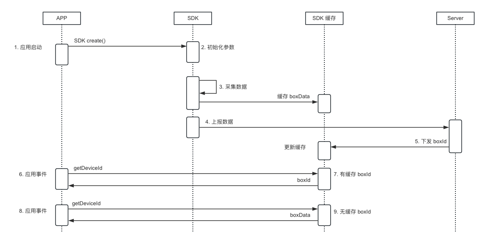

数美设备指纹 SDK（即 'smsdk'）compatibleSdkVersion 10

## 1 工程配置

本章节为 DevEco Studio 工程配置步骤

1. 将 `smsdk_x.x.x.har` 拷贝到 Module（例如 entry 模块） 的 libs 目录下，如果没有 libs 目录则新建 libs 文件夹，或者放到其它位置（确保后续依赖路径一致即可）

2. 在 entry 目录 oh-package.json5 文件中添加 har 引用

   ```json5
   {
     "license": "",
     "devDependencies": {},
     "author": "",
     "name": "entry",
     "description": "Please describe the basic information.",
     "main": "",
     "version": "1.0.0",
     "dependencies": {
       "@ohos/library": "file:./libs/smsdk_x.x.x.har" // 版本号需要与实际导入 smsdk 版本一直
     }
   }
   ```

3. 声明权限，在 module.json5 中添加如下权限

   ```xml
   "requestPermissions": [
       {
         // 联网权限，必选权限
         "name": "ohos.permission.INTERNET",
       },
       {
         // 加速度传感器，可选权限
         "name": "ohos.permission.ACCELEROMETER",
       },
       {
         // 陀螺仪传感器，可选权限
         "name": "ohos.permission.GYROSCOPE",
       },
       {
         // wifi 状态权限，可选权限
         "name": "ohos.permission.GET_WIFI_INFO",
       },
       {
         // 网络状态权限，可选权限
         "name": "ohos.permission.GET_NETWORK_INFO",
       },
       {
         // 广告 ID 权限，可选权限
         "name": "ohos.permission.APP_TRACKING_CONSENT"
       }
     ]
   }
   ```

   权限作用

   | 权限                     | 作用                                                         |
      | ------------------------ | ------------------------------------------------------------ |
   | INTERNET（必选）         | 将采集数据通过网络发送到服务器                               |
   | GET_NETWORK_INFO（必选） | 判断网络是否连接；<br/>获取 network （网络连接状态）信息，如 2g, 3g, 4g, wifi 等，运营商信息 |
   | GET_WIFI_INFO            | 获取 bssid, ssid, band, wifiip 信息                          |
   | ACCELEROMETER            | 获取 加速度 传感器信息                                       |
   | GYROSCOPE                | 获取 陀螺仪 传感器信息                                       |
   | APP_TRACKING_CONSENT     | 获取 OAID 信息                                               |


## 2 标准接入

最简初始化，初始化成功后，会立即进行数据采集，所以需要开发者确保在 ”同意“ 隐私政策前 **不要** 调用 `create` 方法。

```java
// 初始化参数对象
let option = new SmOption();
// 必填，组织标识
option.organization = "YOUR_ORGANIZATION"
// 必填，应用标识，登录数美后台应用管理查看，没有合适值，可以写 "default"
option.appId = "YOUR_APP_ID"
// 必填，加密 KEY，邮件中 harmony_public_key 附件内容
option.publicKey = "YOUR_PUBLICK_KEY"
// 选填，通过 notCollect 取消某字段采集，支持以下字段（大小写敏感）：'bssid', 'ssid', 'wifiIp', 'sensorsData', 'sensor', 'oaid', 'battery', 'band'
// 比如不采集 bssid 和 wifiIp 字段
// option.notCollect = new Set(['bssid','wifiIp']) 
// option.usingHttp = true // 使用 https 协议网络请求，默认 false
// 初始化
SmAntiFraud.create(context as common.UIAbilityContext, option).then(boxId => {
  // 成功回调，获取到 boxId
}).catch(err => {
  // 失败回调，此方法可能一直不会触发
  //   获取错误码：err.code 错误码对应处理方式见 “错误码” 章节描述
  //   获取错误信息：err.message
})
  
// 获取标识，需要在初始化（create）之后调用
SmAntiFraud.getDeviceId().then(box => {
	// 成功回调，获取到 boxId 或 boxData
}).catch(err => {
	// 失败回调
  //   获取错误码：err.code 错误码对应处理方式见 “错误码” 章节描述
  //   获取错误信息：err.message
})
```


初始化调用时机

1. APP 首次启动，同意隐私政策后调用
2. APP 非首次启动，且同意了隐私政策，启动时调用
3. 每调用一次 create 方法就会采集一次设备数据，避免重复调用导致频繁采集问题

`create` 方法采集数据大约需要 200 毫秒（测试数据），采集过程发生在子线程，不会阻塞当前线程。初始化后，可调用 `SmAntiFraud.getDeviceId` 获取标识。

获取标识时机：

1. 在 `create` 方法后调用
2. 在需要上报业务事件时使用，比如登录、注册等关键事件中上报 `getDeviceId` 返回的字符串

同一个 App 活动周期（从应用启动到终止）内，设备标识可能出现变化，比如从 localId 变为 serverId，以下为 sdk 主要流程



应用首次启动，初始化后，如果所有设置以及网络都正常，则会依次完成 2、3、4、5 步骤，此时服务器下发的 boxId；如果有异常情况无法获取到 boxId，则 App 本次活动周期内获取到的标识一直为 boxData，boxData 为全量数据的加密值，长度较长，注意规避上报字长限制，避免出现 boxData 被截断问题。

以上为 smsdk 国内标准接入，如果没有定制化需求，此时已经接入完毕，建议参考 "测试" 章节自查是否接入成功。

海外标准接入（由于数据合规要求，推荐所有海外接入都需要走代理模式，此处为无法提供代理服务的客户使用），切换设备指纹机房，设置如下

1. 业务机房在欧美（弗吉尼亚机房）

   ```java
   // 用户分布范围为欧美
   option.area = Area.fjny
   ```

2. 业务机房在欧美（法兰克福机房）

   ```java
   option.area = Area.flkf
   ```

3. 业务机房在东南亚（新加坡机房）

   ```java
   // 用户分布范围为东南亚
   option.area = Area.xjp
   ```

## 3 私有化接入

主要步骤与标准接入类似，需要增加以下配置

```java
// 设置私有地址，将 private-host 替换为私有化的主机名（域名）
option.url = "https://private-host/deviceprofile/v4" // 示例路径，需要与真实场景一致
```

注意，如果传入 host 为 http 请求，如 `http://private-host`，需要确保 APP 可以发送 http 请求。

## 4 代理接入

smsdk 端上逻辑设置与标准接入类似，需要增加以下配置

```java
// 设置代理地址，将 host 替换为代理服务器的主机名（域名）
option.url = "https://host/deviceprofile/v4" // 示例路径，需要与真实场景一致
```

开发者需要自行搭建代理服务器，代理服务器相关处理参考 ”解密工具及代理服务器说明 代理接入“ 章节。

## 5 测试

1. 调用 `SmAntiFraud.create` 方法可以触发成功回调，并且获取到 smid
2. 调用 `SmAntiFraud.getDeviceId` 方法可以获取标识，无异常产生
3. 通过数美管理后台导航栏选择 ”设备风险趋势"，找到 “设备详情” 部分，查看是否有数据上报（可能存在延时，一般不超过 30 分钟）
4. 无法通过测试时，联系数美工作人员进行排查

## 6 错误码

| 错误码 | 含义       | 解释                                                         | 解决方案                                                     |
| :----- | :--------- | :----------------------------------------------------------- | :----------------------------------------------------------- |
| -1     | 未知       | 理论上不应该出现此错误                                       | 发现后，可以提供 message 发给数美技术支持进行排查            |
| 2102   | 网络问题   | 超时或者其他问题网络 404/503 等，Saas 服务不会出现这种问题，一般出现在代理接入或者私有化接入中 | 自行或者发给数美技术支持进行排查                             |
| 2103   | 内部错误   | 系统不支持当前操作加解密失败                                 | 将设备信息以及 error message 信息发给数美技术支持进行排查    |
| 2200   | 参数错误   | 客户端检查到的参数错误，导致无法将数据上报的服务端，比如秘钥问题，必传参数为空等 | 检查参数是否按照接入文档中传入                               |
| 1902   | 参数错误   | 服务端检查到的参数错误                                       | 代码是否存在混淆？                                           |
| 1903   | 服务失败   | 服务端出现问题                                               | 重试或者保存 requestId 发给数美技术支持进行排查              |
| 1901   | qps 超限   |                                                              | 通知数美技术人员提升 qps                                     |
| 9101   | 服务不可用 | org 错误或者服务未开启                                       | 检查初始化参数 organization 是否有拼写错误，如无问题，发送数美支持进行排查。 |
