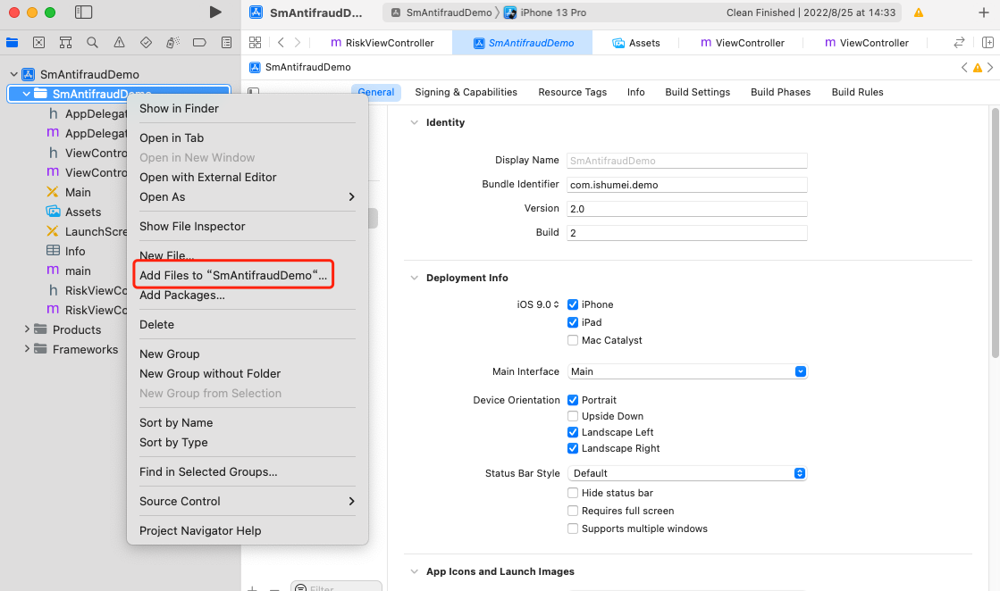
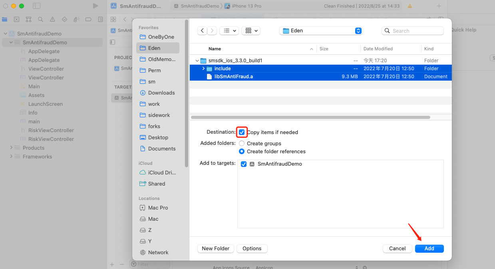
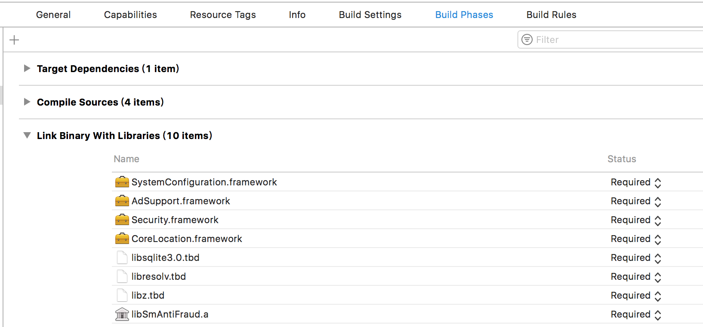
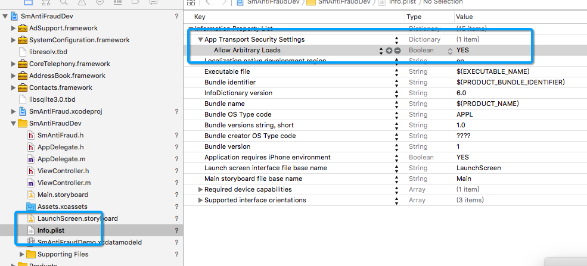
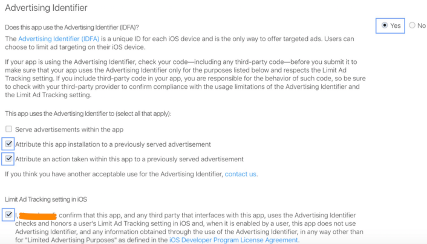

数美设备指纹 SDK（即 'smsdk'）最低支持 iOS 9。

## 1 工程配置

1. 导入 smsdk 静态库，导入 include 文件夹和 libsmantifraud.a 静态库，如图所示

   

   

   

2. 添加 SDK 依赖，在 target 下导入如下依赖库：SystemConfiguration.framework、Security.framework、AdSupport.framework、libresolv.tbd、libz.tbd、libsqlite3.0.tbd、CoreMotion.framework、libsmantifraud.a静态库。如下图所示

   

3. http 设置，smsdk 默认使用 http 请求，需要修改 Info.plist，新增 `[Allow Arbitrary Loads]`，如下所示

   

4. 如果 APP 之前未采集过 IDFA ，上架 App Store 时，需要勾选 Advertising Identifier，并勾选如下选项

   1. Attribute this app installation to a previously served advertisement（跟踪广告带来的安装）
   2. Attribute an action taken within this app to a previously served advertisement（跟踪广告带来的用户的后续行为）
   3. Limit Ad Tracking setting in iOS(属于确认项)

   如图所示

   

## 2 标准接入

最简初始化，初始化成功后，会立即进行数据采集，所以需要开发者确保在 ”同意“ 隐私政策前 **不要** 调用 `create` 方法。

```objective-c
// 初始化参数对象
SmOption *option = [[SmOption alloc] init];
// 必填，组织标识
[option setOrganization: @"YOUR_ORGANIZATION"];
// 必填，应用标识，登录数美后台应用管理查看，没有合适值，可以写 "default"
[option setAppId:@"YOUR_APP_ID"];
// 必填，加密 KEY，邮件中 android_public_key 附件内容
[option setPublicKey:@"YOUR_PUBLICK_KEY"];

// 初始化
BOOL isOk = [[SmAntiFraud shareInstance] create:option];
```

调用 `create` 方法时，smsdk 会检查传入参数是否合法，如果返回值为 `NO`，则需要过滤日志中的 `Smlog` 进行自检。

初始化调用时机

1. APP 首次启动，同意隐私政策后调用
2. APP 非首次启动，且同意了隐私政策，启动时调用

`create` 方法采集数据大约需要 200 毫秒（低端机型会出现超出 1 秒情况），采集过程发生在子线程，不会阻塞当前线程。正常初始化后，可调用 ` [[SmAntiFraud shareInstance] getDeviceId]` 获取标识。

获取标识时机：

1. 在 `create` 方法返回 `YES` 后调用（返回 `NO` 时调用 `getDeviceId` 方法同样有 boxData 返回，但此 boxData 无法转换成设备标识）
2. 在需要上报业务事件时使用，比如登录、注册等关键事件中上报 `getDeviceId` 返回的字符串

部分开发者将 `getDeviceId` 放到所有网络请求的 Header 中，这样做会出现一些问题，需要开发者配合处理，原因及方案将参照 "Android SDK 标准接入 场景二 场景三" 章节。缩减 boxData 长度方法如下（请将这个方法当做备选方案，原因参考 Android 相关说明）

```objective-c
[option setUsingShortBoxData:YES];
```

相对于 Android smsdk，iOS smsdk 采集速度更快，几乎不会发生 ANR 问题，但是如果需要最早时机获取到 boxId，可以通过 Delegate 方式获取，方法如下

1. 继承 `ServerSmidProtocol` 接口，如 `@interface ViewController () <ServerSmidProtocol>`

2. 实现接口的 `smOnSuccess` 和 `smOnError` 方法，如

   ```objective-c
   - (void)smOnSuccess:(NSString*) boxId {
     // 服务器下发成功或缓存中有可用 boxId
   }
   
   - (void)smOnError:(NSInteger) errCode {
     // -1：无网络，常见原因：设备无网络
     // -2：网络异常，网络连接异常或者 http 状态非 200，常见原因：代理或私有化服务器配置错误
     // -3：业务异常，下发业务状态码非 1100，服务器未返回 deviceId，常见原因：参数配置错误、qps 超限、服务器异常
   }
   ```

3. 在 `SmOption` 对象中设置 Delegate，如 `[option setDelegate:self]`

boxId 与 boxData 无法直接当做设备标识，但是可以使用 boxId 或 boxData 直接查询设备风险。查看 ”解密工具及代理服务器说明 设备指纹标识解密“ 章节，了解如何获取明文设备标识。

至此 smsdk 国内标准接入部分已经全部完成，如果没有定制化需求，此时已经接入完毕，建议参考 "测试" 章节自查是否接入成功。

海外标准接入（由于数据合规要求，所有海外接入都需要走代理模式，此处文档为无法提供代理服务的特殊客户使用），需要使用海外专用包，并切换设备指纹机房，设置如下

1. 业务机房在欧美（弗吉尼亚机房）

   ```objective-c
   // 用户分布范围为欧美
   [option setArea:AREA_FJNY];
   // 用户分布范围为全球，则需要开启加速功能，配置如下
   // [option setArea:AREA_FJNY];
   // NSString* host = @"http://fp-na-it-acc.fengkongcloud.com";
   // [option setUrl:[host stringByAppendingString:@"/deviceprofile/v4"]];
   // [option setConfUrl:[host stringByAppendingString:@"/v3/cloudconf"]];
   ```

2. 业务机房在欧美（法兰克福机房）

   ```objective-c
   NSString* host = @"http://api-device-eur.fengkongcloud.com";
   [option setUrl:[host stringByAppendingString:@"/deviceprofile/v4"]];
   [option setConfUrl:[host stringByAppendingString:@"/v3/cloudconf"]];
   ```

3. 业务机房在东南亚（新加坡机房）

   ```java
   // 用户分布范围为东南亚
   [option setArea:AREA_XJP];
   // 用户分布范围为全球，则需要开启加速功能，配置如下
   // [option setArea:AREA_XJP];
   // NSString* host = @"http://fp-sa-it-acc.fengkongcloud.com";
   // [option setUrl:[host stringByAppendingString:@"/deviceprofile/v4"]];
   // [option setConfUrl:[host stringByAppendingString:@"/v3/cloudconf"]];
   ```

## 3 私有化接入

主要步骤与标准接入类似，需要增加以下配置

```objective-c
// 设置私有地址，将 private-host 替换为私有化的主机名（域名）
NSString *host = @"http://private-host"; 
[option setUrl: [host stringByAppendingString:@"/deviceprofile/v4"]]; // 示例路径，需要与真实场景一致
[option setConfUrl:[host stringByAppendingString:@"/v3/cloudconf"]]; // 示例路径，需要与真实场景一致
```

注意，如果传入 host 为 http 请求，如 `http://private-host`，需要确保 APP 可以发送 http 请求，参考 "工程配置" 章节 http 设置部分。私有化接入完成后，需要根据 "测试" 章节进行自测检查。

## 4 代理接入

smsdk 端上逻辑设置与标准接入类似，需要增加以下配置

```java
// 设置私有地址，将 host 替换为代理服务器的主机名（域名）
String host = "https://proxy-host";
[option setUrl: [host stringByAppendingString:@"/deviceprofile/v4"]]; // 示例路径，需要与真实场景一致
[option setConfUrl:[host stringByAppendingString:@"/v3/cloudconf"]]; // 示例路径，需要与真实场景一致
```

开发者需要自行搭建代理服务器，代理服务器相关处理参考 ”代理服务器说明 代理接入“ 章节。

## 5 测试

1. 调用 `[[SmAntiFraud shareInstance] create:option]` 方法获取返回值为 `YES`
2. 调用 `[[SmAntiFraud shareInstance] getDeviceId]` 方法返回值为 boxId，如 `Bm21V93t5QwTNdwyQxxxxxRYuSnOuwwylqZvz8Lixxxxx17lRMqcQ1jz9RwN6qW31/Z0YYmxN8KQnrya9xxxxxx==`
3. 查看控制台是否有 Smlog 异常输出，若有异常输出，请根据提示修改
4. 通过数美管理后台导航栏选择 ”设备风险趋势"，找到 “设备详情” 部分，查看是否有数据上报（可能存在延时，一般不超过 30 分钟）
5. 无法通过测试时，联系数美工作人员进行排查

## 6 SDK 升级

本文适用于 iOS smsdk v2 版本升级到 iOS smsdk v3 版本，smsdk v2 将于 2022 年 12 月 30 日停止维护，希望已接入客户尽快切换到 smsdk v3 版本。

升级步骤及注意事项

1. 删除旧版本 smsdk，将 `SmAntiFraud.h` 和 `libSmAntiFraud.a` 全部从项目中移除
2. 根据 ”iOS SDK 工程配置“ 章节步骤接入新版本 smsdk
3. 新版本中删除了部分 API，替换包后，导致编译失败，直接将 smsdk 报错方法删除即可
4. 运行新 smsdk，根据 ”iOS SDK 测试“ 章节进行自测，如果不成功，请根据错误提示进行修改或联系数美工作人员进行排查
5. 代理接入客户，需要根据 ”解密工具及代理服务器说明 代理接入“ 章节进行代理服务器升级
6. 私有化接入客户，需要联系数美工作人员进行整体升级

smsdk v3 版本终端不再提供明文设备标识，业务端不可以将 boxId 或 boxData 直接当做标识，获取标识方法参考 ”解密工具及代理服务器说明 设备指纹标识解密“。