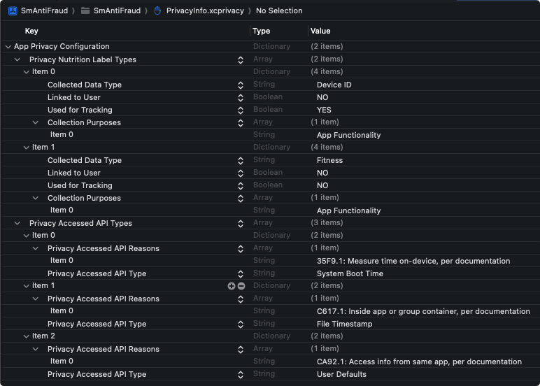

数美设备指纹 SDK（即 'smsdk'）最低支持 iOS 9。

## 1 工程配置

### 1.1 导入 smsdk 包
新版 smsdk 使用 .xcframework 形式的包，导入方式如下：

  1. 复制 SmAntiFraud.xcframework 到项目中

  2. 使用 Xcode 打开项目，点击项目，点击对应的 target，选择 General 页面。

  3. 在  Frameworks,Libraries,and Embedded Content 中，点击 + 号  -> Add Other  -> Add Files -> 选择 SmAntiFraud.xcframework，Embed方式选择 `Do Not Embeded`。

  4. 导入 smsdk 包后，代码中通过  `#import`  导入引用：

     ```objective-c
     #import <SmAntiFraud/SmAntiFraud.h>
     ```

### 1.2 添加 smsdk 依赖

在 TARGETS -> General -> Frameworks,Libraries,and Embedded Content 中导入如下依赖库

   - `IOKit.framework`

### 1.3 http 设置
smsdk 默认使用 http 请求，根据苹果的 ATS 标准，需要配置 Info.plist：

   1. 点击项目的 Info.plist，点击 + 号，选中 App Transport Security Settings
   2. 在 App Transport Security Settings 配置项中，点击 + 号，选择 Allow Arbitrary Loads，并配置为 YES

### 1.4 idfa 配置
如果 APP 之前未采集过 `IDFA` ，上架App Store时，需要根据App Connect的政策，明确app中使用`idfa`并说明原因，

   若不想使用 `IDFA`，可参考下面初始化章节，设置 `notCollect` 不采集 `IDFA`，

   若app归属于儿童类，则联系数美运营提供不包含采集 `IDFA` 相关代码的SDK。

### 1.5 配置隐私文件

根据[苹果隐私政策规定](https://developer.apple.com/documentation/bundleresources/privacy_manifest_files?language=objc)，嵌入数美SDK的app需要在Xcode项目的 PrivacyInfo.xcprivacy 中补全条款，若项目中没有，需要根据[官方说明](https://developer.apple.com/documentation/bundleresources/privacy_manifest_files?language=objc)使用Xcode 15及以上的版本新建一个 PrivacyInfo.xcprivacy 文件。

参考以下两种方式中的任意一种，添加数美SDK依赖的隐私条款：

- 以默认的 Property List 配置

  1. 在 Xcode 中选择 PrivacyInfo.xcprivacy

  2. 将以下条款添加到 PrivacyInfo.xcprivacy 中的`Privacy Nutrition Label Types`和`Privacy Accessed API Types`下，具体配置如下图：

     

- 以 Source Code 配置

  1. 在 Xcode 中右键 PrivacyInfo.xcprivacy，选择 Open As，选择 Source Code。

  2. 添加 NSPrivacyCollectedDataTypes 相关条款：将以下文本粘贴到最外层的`<dict>`和`</dict>`中的key值为`NSPrivacyCollectedDataTypes`下，若无此key值，则需要先创建。

     ```xml
     <key>NSPrivacyCollectedDataTypes</key>
     	<array>
     		<dict>
     			<key>NSPrivacyCollectedDataType</key>
     			<string>NSPrivacyCollectedDataTypeDeviceID</string>
     			<key>NSPrivacyCollectedDataTypeLinked</key>
     			<false/>
     			<key>NSPrivacyCollectedDataTypeTracking</key>
     			<true/>
     			<key>NSPrivacyCollectedDataTypePurposes</key>
     			<array>
     				<string>NSPrivacyCollectedDataTypePurposeAppFunctionality</string>
     			</array>
     		</dict>
     		<dict>
     			<key>NSPrivacyCollectedDataType</key>
     			<string>NSPrivacyCollectedDataTypeFitness</string>
     			<key>NSPrivacyCollectedDataTypeLinked</key>
     			<false/>
     			<key>NSPrivacyCollectedDataTypeTracking</key>
     			<false/>
     			<key>NSPrivacyCollectedDataTypePurposes</key>
     			<array>
     				<string>NSPrivacyCollectedDataTypePurposeAppFunctionality</string>
     			</array>
     		</dict>
     	</array>
     ```
  
  3. 添加 NSPrivacyAccessedAPITypes 相关条款：将以下文本粘贴到最外层的`<dict>`和`</dict>`中的key值为`NSPrivacyAccessedAPITypes`下，若无此key值，则需要先创建。

     ```xml
     <key>NSPrivacyAccessedAPITypes</key>
     	<array>
     		<dict>
     			<key>NSPrivacyAccessedAPITypeReasons</key>
     			<array>
     				<string>35F9.1</string>
     			</array>
                 <key>NSPrivacyAccessedAPIType</key>
                 <string>NSPrivacyAccessedAPICategorySystemBootTime</string>
     		</dict>
     		<dict>
     			<key>NSPrivacyAccessedAPITypeReasons</key>
     			<array>
     				<string>C617.1</string>
     			</array>
     			<key>NSPrivacyAccessedAPIType</key>
     			<string>NSPrivacyAccessedAPICategoryFileTimestamp</string>
     		</dict>
     		<dict>
     			<key>NSPrivacyAccessedAPITypeReasons</key>
     			<array>
     				<string>CA92.1</string>
     			</array>
     			<key>NSPrivacyAccessedAPIType</key>
     			<string>NSPrivacyAccessedAPICategoryUserDefaults</string>
     		</dict>
     	</array>
     ```

## 2 标准接入

### 2.1 初始化

调用SDK的 `-[SmAntiFraud create:]` 方法完成初始化。

初始化非阻塞当前线程，会采集数据并网络传输，缓存 `deviceId`，调用时机如下

1. APP 首次启动，同意隐私政策后调用。
2. APP 非首次启动，且同意了隐私政策，启动时调用。

若`create`方法返回`NO`，则需要检查初始化参数是否正确，可以过滤日志中的 `Smlog` 进行自检。

初始化需要 `SmOption` 实例，其中的具体参数如下

| **字段**          | **参数类型**           | **是否必填** | **默认值**                                      | **字段说明**                                                 |
| ----------------- | ---------------------- | ------------ | ----------------------------------------------- | ------------------------------------------------------------ |
| organization      | NSString*              | 是           | null                                            | 数美分配的公司标识，数美后台可以查看                         |
| appId             | NSString*              | 是           | null                                            | 应用标识，区分不同应用，数美后台可以查看                     |
| publicKey         | NSString*              | 是           | null                                            | 公钥标识，开通账号发送邮件中publicKey项                      |
| url               | NSString*              | 否           | http://fp-it.fengkongcloud.com/deviceprofile/v4 | 设备数据上传的url                                            |
| confUrl           | NSString*              | 否           | http://fp-it.fengkongcloud.com/v3/cloudconf     | 请求云配的url                                                |
| extraInfo         | NSString*              | 否           | null                                            | 额外信息                                                     |
| cloudConf         | BOOL                   | 否           | YES                                             | 是否开启云配功能，YES代表开启                                |
| transport         | BOOL                   | 否           | YES                                             | 是否开启设备指纹功能，YES代表开启                            |
| usingShortBoxData | BOOL                   | 否           | NO                                              | 是否使用较短的boxData，NO代表不使用                          |
| delegate          | `id<ServerSmidProtocol>` | 否           | null                                            | 使用回调方法异步获取标识时，实现`ServerSmidProtocol`的对象   |
| notCollect        | NSArray<NSString*>     | 否           | null                                            | 设置SDK不采集项，目前仅支持"idfa"                            |
| area              | SmAntiFraudArea        | 否           | AREA_BJ                                         | 数据上传和云配的服务器机房地址。<br />AREA_BJ：北京机房<br />AREA_XJP：新加坡机房<br />AREA_FJNY：弗吉尼亚机房 |

### 2.2 获取标识

客户端获取到标识分为 `boxId` 和 `boxData`，**两者都会变化**。若需要唯一不变的标识，查看 ”解密工具及代理服务器说明 设备指纹标识解密“ 章节，了解如何获取明文设备标识。

- 同步方式

  调用SDK的 `-[SmAntiFraud getDeviceId]` 方法获取设备标识，调用时机如下

  1. 初始化`create` 方法返回 `YES` 后 1～2 秒。时间供初始化方法收集数据和网络传输。
  2. 在业务事件时使用，比如登录、注册等关键事件中上报 `getDeviceId` 返回的字符串。

- 异步方式

  异步方式可以在初始化之后，最早时机获取到服务端下发的最新的boxId。

  需要调用`-[SmOption setDelegate:]`设置实现了 `ServerSmidProtocol` 接口的实例对象，具体方式如下

  1. 继承 `ServerSmidProtocol` 接口，如 `@interface ViewController () <ServerSmidProtocol>`

  2. 实现接口的 `smOnSuccess` 和 `smOnError` 方法，如

     ```objective-c
     - (void)smOnSuccess:(NSString*) boxId {
       // 服务器下发成功或缓存中有可用 boxId
     }
     
     - (void)smOnError:(NSInteger) errCode {
       // 服务端下发标识失败，错误码：errCode
       // 尝试使用 `-[SmAntiFraud getDeviceId]` 方法主动获取标识
       // 数美未对errCode进行任何处理，需业务方自行记录，处理分析等
     }
     ```

  3. 在 `SmOption` 对象中设置 `delegate`，如 `[option setDelegate:self]`

  `errCode`错误码列举如下
  
  | errCode | **描述**                                                     |
  | ------- | ------------------------------------------------------------ |
  | -1      | 无网络，常见原因：设备无网络                                 |
  | -2      | 网络异常，网络连接异常或者 http 状态非 200，常见原因：代理或私有化服务器配置错误 |
  | -3      | 业务异常，下发业务状态码非 1100，服务器未返回 deviceId，常见原因：参数配置错误、qps 超限、服务器异常 |
  | -4      | 未知错误                                                     |

### 2.3 代码示例

```objective-c
// 初始化参数对象
SmOption *option = [[SmOption alloc] init];
[option setOrganization: @"YOUR_ORGANIZATION"];// 必填
[option setAppId:@"YOUR_APP_ID"];							 // 必填
[option setPublicKey:@"YOUR_PUBLICK_KEY"];		 // 必填

// 初始化
BOOL isOk = [[SmAntiFraud shareInstance] create:option];
if (!isOk) {
	// 检查option初始化参数是否设置正确
}
```

### 2.4 接入检验

参考 "测试" 章节自查是否接入SDK成功。

## 3 海外业务接入

海外业务需按代理模式接入，若无法提供代理服务，可以使用数美的海外的服务器节点，主要步骤与标准接入相同，需要增加以下配置

1. 业务机房在欧美（弗吉尼亚机房）

   ```objective-c
   // 用户分布范围为欧美
   [option setArea:AREA_FJNY];
   // 用户分布范围为全球，则需要开启加速功能，配置如下
   // [option setArea:AREA_FJNY];
   // NSString* host = @"http://fp-na-it-acc.fengkongcloud.com";
   // [option setUrl:[host stringByAppendingString:@"/deviceprofile/v4"]];
   // [option setConfUrl:[host stringByAppendingString:@"/v3/cloudconf"]];
   ```

2. 业务机房在欧美（法兰克福机房）

   ```objective-c
   NSString* host = @"http://api-device-eur.fengkongcloud.com";
   [option setUrl:[host stringByAppendingString:@"/deviceprofile/v4"]];
   [option setConfUrl:[host stringByAppendingString:@"/v3/cloudconf"]];
   ```

3. 业务机房在东南亚（新加坡机房）

   ```java
   // 用户分布范围为东南亚
   [option setArea:AREA_XJP];
   // 用户分布范围为全球，则需要开启加速功能，配置如下
   // [option setArea:AREA_XJP];
   // NSString* host = @"http://fp-sa-it-acc.fengkongcloud.com";
   // [option setUrl:[host stringByAppendingString:@"/deviceprofile/v4"]];
   // [option setConfUrl:[host stringByAppendingString:@"/v3/cloudconf"]];
   ```

## 4 私有化接入

主要步骤与标准接入类似，需要增加以下配置

```objective-c
// 设置私有地址，将 private-host 替换为私有化的主机名（域名）
NSString *host = @"http://private-host"; 
[option setUrl: [host stringByAppendingString:@"/deviceprofile/v4"]]; // 示例路径，需要与真实场景一致
[option setConfUrl:[host stringByAppendingString:@"/v3/cloudconf"]]; // 示例路径，需要与真实场景一致
```

注意，如果传入 host 为 http 请求，如 `http://private-host`，需要确保 APP 可以发送 http 请求，参考 "工程配置" 章节 http 设置部分。私有化接入完成后，需要根据 "测试" 章节进行自测检查。

## 5 代理接入

主要步骤与标准接入类似，需要增加以下配置

```java
// 设置私有地址，将 host 替换为代理服务器的主机名（域名）
String host = "https://proxy-host";
[option setUrl: [host stringByAppendingString:@"/deviceprofile/v4"]]; // 示例路径，需要与真实场景一致
[option setConfUrl:[host stringByAppendingString:@"/v3/cloudconf"]]; // 示例路径，需要与真实场景一致
```

开发者需要自行搭建代理服务器，代理服务器相关处理参考 “代理服务器说明 代理接入“ 章节。

## 6 测试

1. 调用 `[[SmAntiFraud shareInstance] create:option]` 方法获取返回值为 `YES`。
2. 调用 `[[SmAntiFraud shareInstance] getDeviceId]` 方法返回值为89位的 boxId，如 `Bm21V93t5QwTNdwyQxxxxxRYuSnOuwwylqZvz8Lixxxxx17lRMqcQ1jz9RwN6qW31/Z0YYmxN8KQnrya9xxxxxx==`。
3. 查看控制台是否有 Smlog 异常输出，若有异常输出，请根据提示修改。
4. 通过数美管理后台导航栏选择 ”设备风险趋势"，找到 “设备详情” 部分，查看是否有数据上报（可能存在延时，一般不超过 30 分钟）。
5. 无法通过测试时，联系数美工作人员进行排查。
