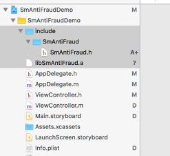
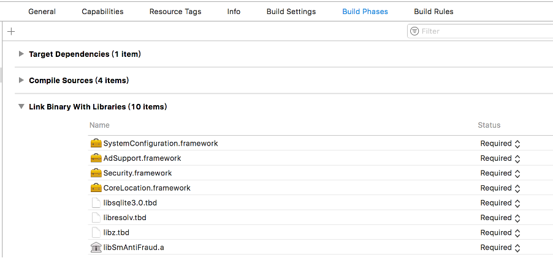
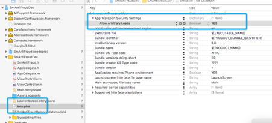
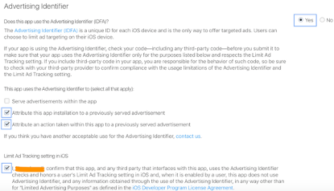

# iOS 设备指纹SDK接入步骤

如果接入过旧版数美SDK，请将旧版SDK的SmAntiFraud.h和libSmAntiFraud.a全部从项目中移除，避免发生旧版SDK干扰新版SDK问题。

1. **导入静态库**

   在工程下导入include文件夹和libsmantifraud.a静态库，如下图所示：

   

2. **添加SDK依赖**

   在target下导入如下依赖库：`SystemConfiguration.framework`、`Security.framework`、`AdSupport.framework`、`libresolv.tbd`、`libz.tbd`、`libsqlite3.0.tbd`、`CoreMotion.framework`、`libsmantifraud.a`静态库。如下图所示：

   

3. **修改Info.plist， 新增`[Allow Arbitrary Loads]`配置。如下图所示**：

   

4.  **初始化SDK**

   - **SDK初始化时机**

     安装后首次启动时，在用户同意隐私协议后，立即初始化SDK。避免出现用户未同意隐私协议已经采集数据问题。

     后继启动时，应在启动后立即初始化SDK。

   - **getDeviceId调用时机**

     SmAntiFraud.getDeviceId()接口在真正需要DeviceId时再进行调用。

     不要再create后立即调用，也不要缓存调用getDeviceId的结果，deviceId在sdk内部会做缓存和更新处理。

   - **初始化代码如下所示**

     ```objective-c
     SmOption *option = [[SmOption alloc] init];
     //1.通用配置项
     [option setOrganization: @"YOUR_ORGANIZATION"]; //必填，组织标识，邮件中organization项
     [option setAppId:@"YOUR_APP_ID"]; //必填，应用标识，登录数美后台应用管理查看，没有合适值，可以写 default
     [option setPublicKey:@"YOUR_PUBLICK_KEY"]; //SDK版本高于2.5.0时必填，加密KEY，邮件中ios_public_key附件内容
     [option setEncryptVer:SM_ENCRYPT_V3]; //SDK高于3.1.0版本，必填
     
     // 2连接机房特殊配置项
     // 2.1业务机房在国内
     //        1) 用户分布：中国（默认设置）
     // [option setArea:AREA_BJ];
     //        2) 用户分布：全球
     // [option setArea:AREA_BJ];
     // NSString* host = @"http://fp-it-acc.fengkongcloud.com";
     // [option setUrl:[host stringByAppendingString:@"/deviceprofile/v4"]];
     // [option setConfUrl:[host stringByAppendingString:@"/v3/cloudconf"]];
     // 2.2业务机房在欧美（弗吉尼亚）
     //        1) 用户分布：欧美
     // [option setArea:AREA_FJNY];
     //        2) 用户分布：全球
     // [option setArea:AREA_FJNY];
     // NSString* host = @"http://fp-na-it-acc.fengkongcloud.com";
     // option setUrl:[host stringByAppendingString:@"/deviceprofile/v4"]];
     // option setConfUrl:[host stringByAppendingString:@"/v3/cloudconf"]];
     //
     // 2.3业务机房在欧美（法兰克福）
     // NSString* host = @"http://api-device-eur.fengkongcloud.com";
     // option setUrl:[host stringByAppendingString:@"/deviceprofile/v4"]];
     // option setConfUrl:[host stringByAppendingString:@"/v3/cloudconf"]];
     
     // 2.4业务机房在东南亚
     //        1) 用户分布：东南亚
     // [option setArea:AREA_XJP];
     //        2) 用户分布：全球
     // [option setArea:AREA_XJP];
     // NSString* host = @"http://fp-sa-it-acc.fengkongcloud.com";
     // option setUrl:[host stringByAppendingString:@"/deviceprofile/v4"]];
     // option setConfUrl:[host stringByAppendingString:@"/v3/cloudconf"]];
     // 
     // 2.5 私有化特殊配置
     // 设置私有地址
     // NSString *host = @"http://private-host"; // 将 private-host 替换为您自己的主机名（域名）
     // [option setUrl: [host stringByAppendingString:@"/deviceprofile/v4"]];
     // [option setConfUrl:[host stringByAppendingString:@"/v3/cloudconf"]];
     
     //3.SDK初始化
     [[SmAntiFraud shareInstance] create:option]; 
     
     //4.获取设备标识，注意获取到的是，这个接口在需要使用deviceId时地方调用
     // 会有极少情况出现 boxData 的情况，boxData 为加密后的采集数据，长度大约 5KB
     NSString* deviceId = [[SmAntiFraud shareInstance] getDeviceId];
     
     ```

5. **如果App之前并未采集过IDFA，使用如下方法通过审核** 

   在提交新版本审核时，在Advertising Identifier勾选YES，同时勾选如下选项:

   - Attribute this app installation to a previously served advertisement（跟踪广告带来的安装）

   - Attribute an action taken within this app to a previously served advertisement（跟踪广告带来的用户的后续行为）

   - Limit Ad Tracking setting in iOS(属于确认项)

     勾选后示例如下图所示：

     

6.  **回调方式获取deviceId，方法如下**

   注意：如果使用回调方法，在用户网络情况差等客观异常情况下，客户端可能会出现获取不到回调的情况，所以建议非必要情况不要使用回调作为获取deviceId的唯一方式，在需要的时候调用getDeviceId()获取即可。

   

   1. 继承ServerSmidProtocol接口：如 `@interface ViewController () <ServerSmidProtocol>`

   2. 实现接口的smOnSuccess和smOnError方法,如下：

      ```objective-c
      - (void)smOnSuccess:(NSString*) serverId {
          NSLog(@"serverId is : %@", serverId);
      }
      
      - (void)smOnError:(NSInteger) errorCode {
          NSLog(@"code: %ld", errorCode);
      }
      
      ```

   3. 在SmOption对象中设置，如：`[option setDelegate:self];`

      