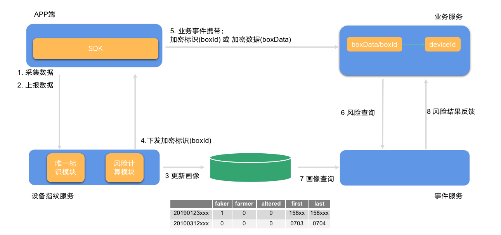
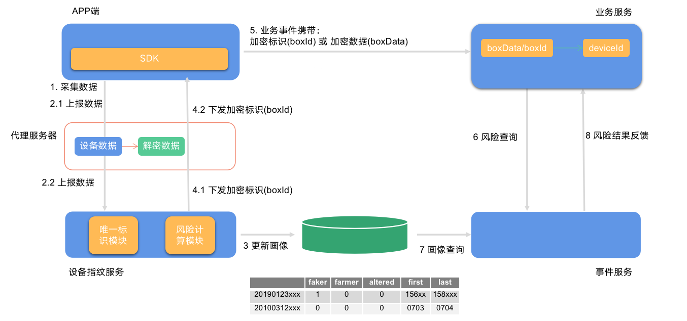

## 1 SDK 下载

### 1.1 Android SDK 

SDK 名称：smsdk

版本号：3.14.*

开发者：北京数美时代科技有限公司

主要功能：基于先进的人工智能技术和全球SaaS风控服务网络，深度融合全栈式模型体系，结合设备风险识别、黑产情报追踪，在业务场景全流程布控，识别并防御薅羊毛、恶意刷榜刷单、虚假用户裂变等营销欺诈行为，为企业的业务增长保驾护航。

更新日志：

```
1. 16k 支持
2. 新增 root 检测特征
3. 新增篡改工具特征
4. 更新加密算法
5. 新版本 SDK 默认使用 https 进行网络请求
6. 优化性能：减少采集耗时，减少创建的线程数
7. 修复权限判断问题: 修正 BSSID/SSID/WIFIIP 字段权限判断
8. 修复资源释放问题: 异常情况下未释放文件资源
```

[SDK接入手册](https://help.ishumei.com/docs/tw/sdk/android/developDoc)

[合规使用说明](https://help.ishumei.com/docs/tw/sdk/guide/developDoc)

[个人信息处理规则](https://www.ishumei.com/legal/cn/privacy.html?productHelp=/docs/tw/sdk/guide/developDoc)

下载说明：注册（[注册地址](https://www.ishumei.com/account/register.html?crmSource=%E8%AE%BE%E5%A4%87%E6%8C%87%E7%BA%B9-banner)）账号并审核通过后，客服会主动联系提供 SDK 包及相关接入资料。

### 1.2 iOS SDK

SDK 名称：smsdk

版本号：3.13.*

开发者：北京数美时代科技有限公司

主要功能：基于先进的人工智能技术和全球SaaS风控服务网络，深度融合全栈式模型体系，结合设备风险识别、黑产情报追踪，在业务场景全流程布控，识别并防御薅羊毛、恶意刷榜刷单、虚假用户裂变等营销欺诈行为，为企业的业务增长保驾护航。

更新日志：

```
1. 新增篡改工具特征
2. 更新加密算法
3. 优化采集耗时
4. 移除部分采集项，详见采集项列表
```

[SDK接入手册](https://help.ishumei.com/docs/tw/sdk/iOS/developDoc)

[合规使用说明](https://help.ishumei.com/docs/tw/sdk/guide/developDoc)

[个人信息处理规则](https://www.ishumei.com/legal/cn/privacy.html?productHelp=/docs/tw/sdk/guide/developDoc)

下载说明：注册（[注册地址](https://www.ishumei.com/account/register.html?crmSource=%E8%AE%BE%E5%A4%87%E6%8C%87%E7%BA%B9-banner)）账号并审核通过后，客服会主动联系提供 SDK 包及相关接入资料。

### 1.3 Harmony SDK

SDK 名称：smsdk

版本号：3.3.*

开发者：北京数美时代科技有限公司

主要功能：基于先进的人工智能技术和全球SaaS风控服务网络，深度融合全栈式模型体系，结合设备风险识别、黑产情报追踪，在业务场景全流程布控，识别并防御薅羊毛、恶意刷榜刷单、虚假用户裂变等营销欺诈行为，为企业的业务增长保驾护航。

更新日志：

```
1. 增加录屏特征
2. 增加多开特征
3. 增加 sim 特征
4. 增强标识稳定性
4. 修复权限问题，此问题导致部分情况下获取 oaid 异常
```

[SDK接入手册](https://help.ishumei.com/docs/tw/sdk/harmony/developDoc)

[合规使用说明](https://help.ishumei.com/docs/tw/sdk/guide/developDoc)

[个人信息处理规则](https://www.ishumei.com/legal/cn/privacy.html?productHelp=/docs/tw/sdk/guide/developDoc)

下载说明：注册（[注册地址](https://www.ishumei.com/account/register.html?crmSource=%E8%AE%BE%E5%A4%87%E6%8C%87%E7%BA%B9-banner)）账号并审核通过后，客服会主动联系提供 SDK 包及相关接入资料。

## 2 术语解释

| 术语         | 解释                                                         |
| ------------ | ------------------------------------------------------------ |
| Organization | 组织标识，开通服务获取或单独邮件发送；启动 SDK 必传参数之一 |
| AppId        | 应用标识，开通服务获取或单独邮件发送；启动 SDK 必传参数之一 |
| PublicKey    | 加密公钥，开通服务获取或单独邮件发送；启动 SDK 必传参数之一 |
| boxId        | 设备指纹加密标识，客户端通过getDeviceId()方法获取到的值，以字母 'B' 开头的字符串，长度为 89 个字符 |
| boxData      | 设备指纹加密数据，客户端通过getDeviceId()方法获取到的值，以字母 'D' 开头的字符串，长度约 8K 字符 |
| 标准接入     | SAAS 模式，设备数据托管到数美平台进行统一管理，分为国内、东南亚、欧美机房 |
| 代理接入     | 设备数据优先发送到业务代理服务器，进行数据审查或其他数据管理，业务代理服务器对上传设备数据进行转发 |
| 私有化接入   | 设备数据存放在客户机房，相当于将 SAAS 服务部署到客户机房内   |

## 3 标准接入

非定制化接入全部属于标准接入，标准接入最为简单快速，适用于国内用户接入。标准接入整体数据流图，如下



接入关键步骤

1. App 接入移动端 SDK，移动平台包括：Android/iOS/Web/小程序
2. （图示 1 至 4 ）启动 SDK 进行数据采集，获取 boxId
3. （图示 5）业务事件如注册、登录等上报业务服务器时携带 boxId 或 boxData
4. （图示 6 至 8）业务服务器根据 boxId 或 boxData 查询设备风险或设备标识

## 4 代理接入

代理接入需要客户搭建代理服务器，设备指纹 SDK 将设备数据通过代理服务器进行中转。代理接入主要有两个目的，目的一，用户海外接入，数据优先经过业务代理服务器，进行数据合规处理；目的二，用户需要借助采集数据进行二次开发。代理接入整体数据流图，如下



接入关键步骤

1. App 接入移动端 SDK，移动平台包括：Android/iOS/Web/小程序
2. 搭建代理服务器，代理服务器中可以将图示 2.1 中上报设备数据进行解密，可对数据进行数据审核或其他二次开发。
3. （图示 1 至 4.2）采集并透传设备数据和 boxId
4. （图示 5）业务事件如注册、登录等上报业务服务器时携带 boxId 或 boxData
5. （图示 6 至 8）业务服务器根据 boxId 或 boxData 查询设备风险或设备标识

代理服务器需要客户自行搭建，需要确保其稳定性，避免由于代理服务器导致的数据异常问题。

## 5 私有化接入

私有化接入属于高度定制，需要数美提供部署服务，包括设备指纹服务、设备画像、事件服务等。部署完成有，整个数据流与标准接入相同，不同点在于所有服务都部署在客户机房。
