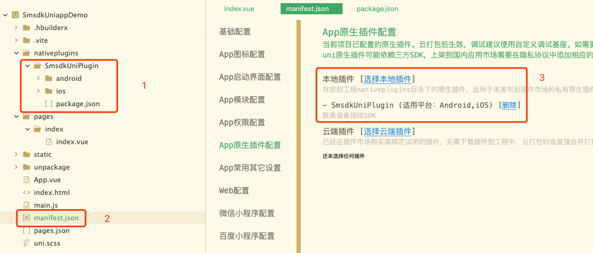

## 数美设备指纹 uniapp 接入手册

数美设备指纹 SDK 支持 App原生插件本地插件，相关基础知识参考 uniapp 官方 [插件说明](https://nativesupport.dcloud.net.cn/NativePlugin/README)。

### 1 SDK 接入

#### 1.1 添加本地插件

1. 将 `SmsdkUniPlugin` 文件夹放入 `YOUR_PROJECT/nativeplugins` 目录
2. HBuilderX 选中 `manifest.json`，选择 App原生插件配置
3. 点击本地插件 `[选择本地插件]`，勾选 SmsdkUniPlugin



#### 1.2 引入插件

```js
// 示例代码位置：SmsdkUniappDemo/pages/index/index.vue
const SmAntiFraud = uni.requireNativePlugin('SmsdkUniPlugin');
```

#### 1.3 sdk API

#####  初始化 smsdk

```js
SmAntiFraud.create({
    'org': 'YOUR_ORGANIZATION',                   // 组织表示
    'appid': 'YOUR_APPID',                        // appId
    'publicKeyAndroid': YOUR_ANDROID_PUBLICK_KEY, // Android publicKey
    'publicKeyIOS': YOUR_IOS_PUBLICK_KEY,         // iOS publicKey
    'url': 'YOUR_URL',                            // 设备指纹请求地址
    'confUrl': 'YOUR_CONF_URL',                   // 云配请求地址
    'notCollect': 'imei imsi',                    // Android 不采集项（每项使用空格隔开）
    'area': 'YOUR_AREA',                          // 区域
    'usingHttps': [false|true]                    // 是否使用 https 传输数据
  },
  (ret) => {
    console.log(JSON.stringify(ret));
});
```

ret 结构

```json
{
  "smid": "xxx", // 设备标识，如果无 smid 字段，可以查看 code 
  "code": -1 // 错误码，含义参考原生接入手册
}
```

##### 获取标识

```js
SmAntiFraud.getDeviceId();
```

##### 其它方法

获取 sdk 版本号

```js
SmAntiFraud.getSdkVersion();
```

### 2 打包

使用 HBuilderX -> 发行 -> 原生APP-云打包 生成 apk 或者 ipa 包，具体打包方式，参考 DCloud 官方说明。

### 3 注意事项

#### 3.1 数据合规

smsdk 调用初始化方法时会采集设备数据，为避免数据违规问题，需要在 app 隐私政策中添加数美隐私协议，同意隐私政策后再进行初始化。

数美隐私协议参考《数美设备风险SDK接入手册》。

#### 3.2 验证是否接入成功

- 初始化完成后，调用`SmAntiFraud.getDeviceId()` 方法获取到 serverId 或 boxId 即代表接入成功，其他为失败。serverId 和 boxId 示例参考《数美设备风险SDK接入手册》；

- `SmAntiFraud.create` 方法回调中返回 `"smid": "xxx"` 代表接入成功，回调方法参考 1.3 小节 "初始化 smsdk" 部分；
