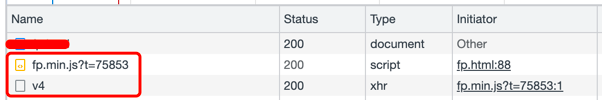

## 设备指纹web-sdk接入手册

- 在需要使用数美反欺诈服务的页面嵌入SDK即可，例如注册、登录等页面，其它页面不用嵌入。

- WEB SDK不需要下载额外SDK包，直接按照如下步骤接入即可。

### 1. 初始化SDK
在页面底部引入如下所示代码：

最新版本：3.0.0

```javascript
(function() {
    window._smReadyFuncs = [];
    window.SMSdk = {
        onBoxDataReady: function (boxData) { // 非必填
            console.log('此时拿到的数据为boxData或者boxId', boxData);
        },
        ready: function (fn) {
            fn && _smReadyFuncs.push(fn);
        }
    };

    // 1. 通用配置项
    window._smConf = {
        organization: 'xxxxxxxxxx', // 必填，组织标识，邮件中organization项
        appId : 'xxxxxxxxxx', // 必填，应用标识，默认传值default，其他应用标识提前联系数美协助定义
        publicKey : 'xxxxxxxxxx', // 必填，私钥标识，邮件中publicKey项 
        staticHost: 'static.portal101.cn', // 必填, 设置JS-SDK文件域名，建议填写static.portal101.cn
        protocol: 'https', // 如果使用https，则设置，如不使用，则不设置这个字段

       // 2. 连接海外机房特殊配置项，仅供设备数据上报海外机房客户使用 
       // 2.1 业务机房在国内
       // 1) 用户分布：国内（默认设置）
       // apiHost:'fp-it.portal101.cn'
       // 2) 用户分布：全球 
       // apiHost:'fp-it-acc.portal101.cn'

       // 2.2 业务机房在欧美（弗吉尼亚）
       // 1) 用户分布：欧美
       // apiHost: 'fp-na-it.portal101.cn'
       // 2) 用户分布：全球
       // apiHost: 'fp-na-it-acc.portal101.cn'

       // 2.3 业务机房在欧美（法兰克福）
       // apiHost: 'api-device-eur.portal101.cn'
      
       // 2.4 业务机房在东南亚
       // 1) 用户分布：东南亚
       // apiHost:'fp-sa-it.portal101.cn'
       // 2) 用户分布：全球
       // apiHost:'fp-sa-it-acc.portal101.cn'
      
       // 2.5 私有化特殊配置
       // staticHost: 'xxxxxx' // 私有化客户自己引入线上cdn地址，此项必填；如果客户本地引入js文件，此项不填
       // apiHost: 'xxxxxx';  // 私有化部署的服务域名
    };

    var url = (function () {
        var isHttps = 'https:' === document.location.protocol;
        var protocol = isHttps ? 'https://' : 'http://';
        var fpJsPath = '/dist/web/v3.0.0/fp.min.js';
        var url =  protocol + _smConf.staticHost + fpJsPath;
        return url;
    })();
    var sm = document.createElement('script');
    var s = document.getElementsByTagName('script')[0];
    sm.src = url;
    s.parentNode.insertBefore(sm, s);
})();
```

### 2. 使用设备标识

```javascript
/**
 * 绑定事件
 * @param element
 * @param eventType
 * @param func
 */
function bindEvent(element, eventType, func) {
    if (element.addEventListener) {
        element.addEventListener(eventType, func, false);
    }
    else if (element.attachEvent) {
        eventType = 'on' + eventType;
        element.attachEvent(eventType, func);
    }
    else {
        eventType = 'on' + eventType;
        element[eventType] = func;
    }
}

/**
 * cb业务逻辑
 * 使用数美设备标识逻辑
 */
function dealSmDeviceId(cb) {
    var smDeviceId = '';
    var smDeviceIdReady = false;

    SMSdk.ready(function () {
        if (SMSdk.getDeviceId) {
            smDeviceId = SMSdk.getDeviceId();
        }
        if (!smDeviceIdReady) {
            smDeviceIdReady = true;
            // 执行业务逻辑
            cb && cb(smDeviceId);
        }
    });
}

// 客户根据实际情况选择以下场景，如有疑问直接联系数美技术支持答疑
// 场景一：需要点击按钮（如：登录、注册、领卷等）交互场景使用
var buttonEl = document.getElementById('getDeviceId');
bindEvent(buttonEl, 'click', function () {
    dealSmDeviceId(function (deviceId) {
        console.log('回调执行成功，设备标识为：' + deviceId);
    });
});

// 场景二：无需交互直接使用（如：浏览）
dealSmDeviceId(function (deviceId) {
    console.log('回调执行成功，设备标识为：' + deviceId);
});
```

- 获取到的deviceId如果通过POST方式请求后端接口，可以直接传参；如果通过GET方式请求后端接口，URL参数值需要使encodeURIComponent进行编码，服务端使用对应语言的decode代码进行处理。
- 避免页面多次引用，引用后可通过抓包查看fp.min.js的引用次数。
  除了上述提到的两个使用场景外，如果有其他使用方式建议联系数美技术支持一起讨论新的方案。

### 3. 检查接入是否成功

- 在数美管理后台可查看SDK上传的数据，通过检查上传数据，可确认接入是否成功。查看方法参见第2章节。

- 抓包校验接入是否成功，接入完成后，页面加载时, fp.min.js加载成功，/deviceprofile/v4，如下图所示：




### 参数

| **字段** | **参数类型**  | **是否必填** | **默认值** | **字段说明** |
| -- | -- | -- | -- | -- |
| organization | string | 是 | 无 | 数美分配的公司标识，数美后台可以查看看 |
| appId | string | 是 | 无 | 应用标识，区分不同应用，数美后台可以管理 |
| publicKey | string | 是 | 无 | 私钥标识，邮件中publicKey项  |
| staticHost | string | 是 | 无 | 设置JS-SDK文件域名 |
| protocol | string  | 否 | http | 如果使用https，则设置成http，如不使用，则不设置这个字段 |
| apiHost  | string  | 否 | fp-it.portal101.cn  | 数据上报的域名，详见`APIHOST`枚举值 |

#### `APIHOST`枚举值
| **业务机房所在区域** | **用户分布**  | **apiHost值** |
| -- | -- | -- |
| 国内 | 国内（默认设置） | fp-it.portal101.cn |
| 国内 | 全球 | fp-it-acc.portal101.cn |
| 欧美（弗吉尼亚）| 欧美 | fp-na-it.portal101.cn |
| 欧美（弗吉尼亚）| 全球| fp-na-it-acc.portal101.cn |
| 欧美（法兰克福）| - | api-device-eur.portal101.cn |
| 东南亚 | 东南亚 | fp-sa-it.portal101.cn |
| 东南亚 | 全球 | fp-sa-it-acc.portal101.cn |

### 方法
| **方法名** | **参数** | **返回值**  | **说明** |
| -- | -- | -- | -- |
| onBoxDataReady | boxData  | 无 | 回调函数，在获取到boxData的时刻执行，参数值即为boxData或者boxId |
| ready | fn | 无 | 回调函数，在前端接口请求成功或失败后执行 |
| getDeviceId | - | string | 返回deviceId |
