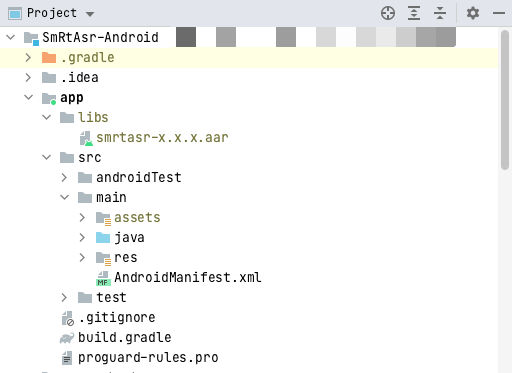

# android 音频实时转义SDK接入步骤

1. **导入 SDK 包**

   1. 将 `smrtasr-${version}.aar` 拷贝到 app Module 的 libs 目录，如图所示

   

   `smrtasr-x.x.x.aar` 名称中 `x.x.x` 代表版本号，如 `smrtasr-1.0.0.aar`

   2. 在 `app/build.gradle` 文件中添加如下配置

   ```groovy
   dependencies {
     // 需要将 SDK 添加到 libs 中，并将 smrtasr-x.x.x.aar 替换为对应版本 SDK
     implementation fileTree(dir: "libs", include: ["smrtasr-x.x.x.aar"])
   }
   ```

   3. 在 `AndroidManifest.xml` 文件中添加权限

   ```xml
   <uses-permission android:name="android.permission.INTERNET" />
   ```

   4. SDK 最低支持 Android API LEVEL 14，确保项目 minSdkVersion 版本不小于 14

   ```groovy
   // build.gradle
   android {
     ...
     defaultConfig {
       minSdkVersion 14
       ...
     }
     ...
   }
   ```

   上述导入过程是在 Android Studio 进行，如在其他 IDE 中使用 SDK 需要自行适配。

2. **SDK 代码接入**

   1. 启动SDK

      ```java
      SmRtAsrClient.AsrOption option = new SmRtAsrClient.AsrOption();
      // 必填参数，Organization 由数美提供
      option.setOrganization(YOUR_ORGANIZATION);
      // 必填参数，AccessKey 由数美提供
      option.setAccessKey(YOUR_ACCESS_KEY);
      // 选填参数，默认值为 "default"，格式：字母组成的长度小于 64 位的字符串
      option.setAppId(YOUR_APP_ID);
      // 选填参数，设置 websocket 数据传输机房，机房位置需要联系数美客服
      option.setWsUrl(WS_URL);
      // 选填参数，设置 http 数据传输机房，机房位置需要联系数美客服，websocket 通讯失败时会暂时切换到 http 通讯
      option.setHttpUrl(SESSION_START_URL);
      
      // 启动，context 为非空必传参数
      SmRtAsrClient client = SmRtAsrClient.create(context, option);
      ```

      必填参数传空或格式异常，如参数中带有空白字符时，`create` 方法会返回 `null` 对象，请根据 `logcat`  提示修改相关参数，日志 TAG 为 `Smlog`。

   2. 开启会话

      ```java
      SessionConfig config = new SessionConfig();
      // 设置会话语言，默认 "zh"，格式：http://www.lingoes.cn/zh/translator/langcode.htm
      config.setLanguage(String);
      // 设置是否需要匹配功能，默认为 false，若设置为 true 则必须设置匹配内容
      config.setEnableMatch(boolean);
      // 匹配方式，关键字包含匹配方式，支持参数
      //  - text：文本包含匹配（默认值）
      //  - number： 数字等于匹配
      config.setMatchMode(String);
      // 设置匹配内容，文本包含匹配设置关键词，数字等于匹配时设置关键数字阿拉伯形式字符串（如，"123"）
      // 匹配内容最多传入 5 个元素，每个小于等于 30 字符
      List<String> keywords = new ArrayList<>();
      keywords.add(String);
      config.setKeywords(keywords);
      // 设置是否返回转写文本，默认 true
      config.setReturnText(boolean);
      // 设置是否需要数字提取功能，默认 false
      config.setReturnNumbers(boolean);
      // 设置音频类型，默认 pcm
      config.setVoiceType(String);
      // 设置音频采样频率，默认 16000
      config.setVoiceSample(int);
      // 设置音频编码格式，默认 s16le
      config.setVoiceEncode(String);
      // 扩展字段
      config.setExtra(JSONObject);
      // 回调监听，注意：回调方法处于主线程，请勿在回调方法中直接进行耗时操作。
      config.setListener(new SmAsrSessionListener());
      // 开启会话
      client.startSession(config);
      ```

      开启会话后可以发送音频数据，若开启会话后一段时间内没有发送音频数据，本次会话会过期，需要重新开启会话。SDK 目前不支持多会话交互，多次调用 `startSession` 只有最新的一次 session 有效。

      SmAsrSessionListener 类结构如下

      ```java
      public interface SmAsrSessionListener {
          //
          // 接收到服务器回传的数据，postAudio 期间会多次触发此方法
          //
          // @param sessionId 会话 ID，用于唯一标识一次会话
          // @param requestId 当次请求 ID，用于唯一标识一次请求
          // @param response {@link SmAsrResponse}
          //
          void onReceived(String sessionId, String requestId, SmAsrResponse response);
      
          //
          // 异常，具体错误码及处理方式见 错误码 表格
          //
          // @param sessionId 会话 ID，用于唯一标识一次会话
          // @param requestId 当次请求 ID，用于唯一标识一次请求
          // @param errCode 异常状态码，一个状态码对应一类错误类型
          // @param message 异常码对应信息，一个状态码可能存在多种错误信息
          //
          void onError(String sessionId, String requestId, int errCode, String message);
      }
      ```

      SmAsrResponse 主要方法如下

      ```java
      // 识别结果，原始文本
      public String getText();
      // 断句标识
      //  0 代表中间句
      //  1 代表完整句
      public int getType();
      // 判断识别结果中是否命中关键词
      public boolean isHit();
      // 匹配结果
      public JSONArray getMatchResults();
      // 提取转数字提取
      public JSONArray getNumbers();
      ```

      `getMatchResults()` 方法返回的数据结构如下：

      ```json
      [{
        // 命中的匹配内容，String 类型
        "hitItemContent": "你好", // 数字等于匹配此字段值为数字字符串，如 "123"	
        // 命中的匹配内容在原文中的开始位置（包含）和结束位置（不包含），如果匹配内容多次出现，会出现多个位置
        "positions": [[0, 2]，[2, 4]]
      }, {
        "hitItemContent": "世界", 
        "positions": [[5, 7]]
      }]
      ```

      `getNumbers()` 方法返回的数据结构如下：

      ```json
      [{
        // 提取的数字，整数型
        "number": 123,	
        // 提取的数字在原文中的位置起止位置，如果匹配内容多次出现，会出现多个位置
        "positions": [[0, 3], [5, 8]]
      }, {
       "number": 456,	
        "positions": [[10, 13]]
      }]
      ```

   3. 发送音频数据
   
      ```java
      // 发送音频数据
      //
      // 此方法会复制 audio 数据然后内部处理复制后的数据进行上报，为保证识别效果，复制过程中禁止修改 audio 数据
      //
      // @param audio 音频数据，默认类型：pcm，编码：s16le，采样：16000
      // @return 发送音频数据是否成功
      //  - false: 没有开启会话，或者会话失败导致当前 audio 未能添加到待转发队列
      //  - true: 发送成功，结果会在 {@link SmAsrSessionListener#onReceived(SmAsrResponse)} 回调中展示
      client.postAudio(byte[] audio);
      ```
   
      每个音频切片需要控制在 300 到 400 毫秒之间。
   
      发送音频数据后，可以在 `void onReceived(String, String, SmAsrResponse)` 回调中监听回调结果，比如调用 `response.getText()` 获取当前音转文信息，使用 `response.isHit() ` 判断当前音频是否命中关键词。
   
   4. 关闭会话
   
      ```java
      // 结束会话
      client.stopSession();
      ```
   
      调用 `stopSession()` 方法主动关闭会话。
   
   5. 销毁 SDK
   
      ```java
      // 销毁 SDK 释放资源
      client.destroy()
      ```
   
      调用 `destroy()` 方法，SDK 会释放资源，如网络线程，缓存数据等。
   
3. **错误码**

   | 错误码 | 信息       | 原因                                                         | 推荐处理方式                                                 |
   | ------ | ---------- | ------------------------------------------------------------ | ------------------------------------------------------------ |
   | 1901   | qps 限制   | 请求达到服务器预定 qps 限制                                  | 如果大量触发，需要联系数美人员提高 qps 限制                  |
   | 1902   | 参数不合法 | 参数错误                                                     | 1. 调用 stopSession  结束本次 session<br />2. 检查 Organization，AccessKey 是否填写错误 |
   | 2101   | 无网络     | 设备无网络                                                   | 忽略                                                         |
   | 2102   | 语音丢包   | 网络异常导致语音频段无法上传到服务器                         | 忽略                                                         |
   | 2103   | 语音放弃   | 发送语音包过于频繁（如 4 秒发送了超过 100 个片段）超出缓存限制，导致新加入的语音片段会被丢弃 | 忽略                                                         |
   | 2301   | 状态错误   | SDK API 调用错误，比如未启动时调用了 startSession          | 确保优先启动SDK                                               |
   | 2401   | 服务端错误 | 服务未按照协议发送数据                                       | 忽略                                                         |
   | 2402   | 服务端错误 | 服务未按照协议发送数据                                       | 忽略                                                         |
   | 2403   | 服务端错误 | 服务未按照协议发送数据                                       | 忽略                                                         |
   | 9101   | 无权限操作 | 参数错误或者相关服务为开通                                   | 调用 stopSession  结束本次 session<br />检查 Organization，AccessKey 是否填写错误，联系数美人员检查相关服务是否开通 |

