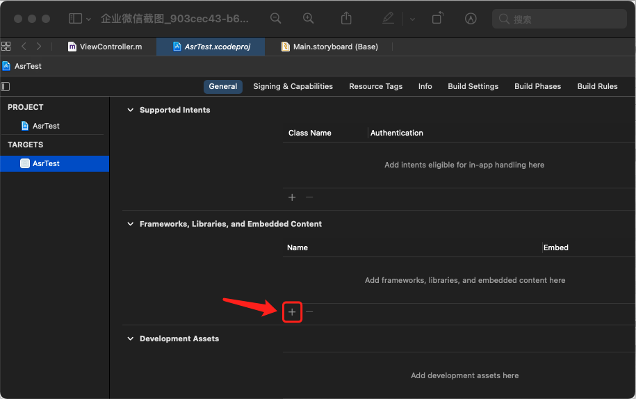
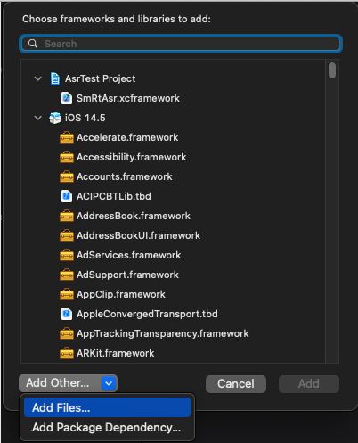
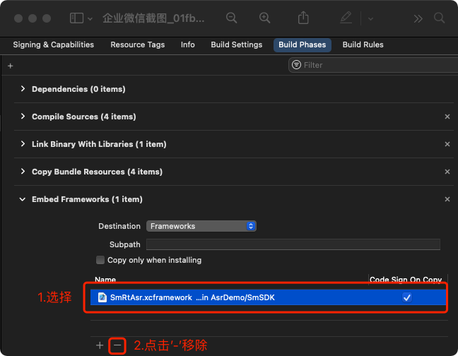

# iOS 音频实时转义SDK接入步骤

1. **导入 SDK 包**

   1. 复制 `SmRtAsr.xcframework` 到项目中

   2. 使用 Xcode 打开项目，点击项目，点击对应的 target，选择 General 页面。

   3. 在 Frameworks 中，选择 `Frameworks,Libraries,and Embedded Content` 中，点击 `+` 号  -> Add Other  -> ad d Files -> 选择 `SmRtAsr.xcframework`。如下：

      

      

   4. 在 target 的 `Build Phases` 的 `Embed Frameworks` 下取消 `SmRtAsr.xcframework` 的引用，如图：

      

   5. SDK 最低支持 iOS 9，支持 bitcode。

   6. 在项目中使用导入头文件，即可使用 SDK。

      ```objective-c
      #import <SmRtAsr/SmRtAsr.h>
      ```

      

2. **SDK 代码接入**

   1. 初始化

      ```objective-c
      SmRtAsrOption *option = [[SmRtAsrOption alloc] init];
      // 必填参数，Organization 由数美提供
      [option setOrganization:@YOUR_ORGANIZATION];
      // 必填参数，AccessKey 由数美提供
      [option setAccessKey:@YOUR_ACCESS_KEY];
      // 选填参数，默认值为 "default"
      [option setAppId:@YOUR_ACCESS_KEY];
      // 选填参数，设置 websocket 数据传输机房，机房位置需要联系数美客服
      [option setWsUrl:@WS_URL];
      // 选填参数，设置 http 数据传输机房，机房位置需要联系数美客服，websocket 通讯失败时会暂时切换到 http 通讯
      [option setHttpUrl:@HTTP_URL];	
      // 初始化
      SmRtAsrClient *client = [[SmRtAsrClient shareInstance] initWithOption:option];
      ```

      必填参数传空或格式异常，如参数中带有空白字符时，`create` 方法会返回 `nil` 对象，请根据 xcode 控制台提示修改相关参数，日志 TAG 为 `Smlog`。

   2. 实现 SmRtDelegate

       实现 SmRtDelegate，并实现 onRtError 和 onRtReceived 方法，如下：

      ```objective-c
      @interface ViewController ()<SmRtDelegate>
      
      @end
      
      @implementation ViewController
      
      - (void)onRtReceived:(NSString *)sessionId requestId:(NSString *)requestId response:(SmAsrResponse *)response
      {
        // 接收到服务器回传的数据，postAudio 期间会多次触发此方法
      }
        
      - (void)onRtError:(NSString *)sessionId requestId:(NSString *)requestId errorCode:(NSInteger)errorCode message:(NSString *)message
      {
        // errorCode 错误码，具体值及含义见 错误码 表格
      }
      
      @end
      ```

      其中 `SmAsrResponse` 部分定义如下：

      ```objective-c
      @interface SmAsrResponse : NSObject
      
      // 识别结果
      @property NSString *text;
      // 识别结果标识 
      //  0：中间句 
      //  1：完整句
      @property NSInteger type;
      // 判断是否命中关键词，YES 表示命中
      -(BOOL) isHit;
      // 匹配结果
      @property NSArray<NSDictionary*> *matchedResults;
      // 提取数字功能返回
      @property NSArray<NSDictionary*> *numbers;
      
      @end
      ```

      根据 `SmAsrResponse` 结构可以通过点取相应的值。

      其中 `matchedResults` 包含的 key 值和 value 类型如下：

      ```txt
      [{
        // 命中的匹配内容，String 类型
        "hitItemContent": "你好", // 数字等于匹配此字段值为数字字符串，如"123"	
        // 命中的匹配内容在原文中的开始位置（包含）和结束位置（不包含），如果匹配内容多次出现，会出现多个位置
        "positions": [[0, 2]，[2, 4]]
      }, {
        "hitItemContent": "世界", 
        "positions": [[5, 7]]
      }]
      ```

      `numbers `包含的 key 值和 value 类型如下：

      ```txt
      [{
        // 提取的数字，整数型
        "number": 123,	
        // 提取的数字在原文中的位置起止位置，如果匹配内容多次出现，会出现多个位置
        "positions": [[0, 3], [5, 8]]
      }, {
       "number": 456,	
        "positions": [[10, 13]]
      }]
      ```

   3. 开启会话

      ```objective-c
      SmRtSessionConfig *config = [[SmRtSessionConfig alloc] init];
      // 设置会话语言，默认 "zh"，格式：http://www.lingoes.cn/zh/translator/langcode.htm
      [config setLanguage:@"zh"];
      // 设置是否需要匹配功能，默认为 NO，若设置为 YES 则必须设置匹配内容
      [config setEnableMatch:YES];
      // 匹配方式，关键字包含匹配方式，支持参数
      //  - text：文本包含匹配（默认值）
      //  - number: 数字等于匹配
      [config setMatchMode:@"text"];
      // 匹配内容，键字词最多传入 5 个，每个小于等于 30 字符
      [config setKeyWords: @[@YOUR_KEYWORDS]];	
      // 设置是否返回转写文本，默认 YES
      [config setReturnText:YES];
      // 设置是否需要数字提取功能，默认 NO
      [config setReturnNumbers:YES];
      // 设置音频类型，默认 pcm
      [config setVoiceType:@"pcm"];
      // 设置音频采样频率，默认 16000
      [config setVoiceSample:16000];
      // 设置音频编码格式，默认 s16le
      [config setVoiceEncode:@"s16le"];
      // 扩展字段
      [config setExtra:@{}]
      // 设置 SmRtDelegate 回调，注意：回调方法处于主线程，请勿在回调方法中直接进行耗时操作。
      [config setDelegate:self];
      [client startSession:config];
      ```

      开启会话后可以发送音频数据，若开启会话后一段时间内没有发送音频数据，本次会话会过期，需要重新开启会话。SDK 目前不支持多会话交互，多次调用 `startSession` 只有最新的一次 session 有效。

   4. 发送音频数据

      ```objective-c
      // 发送音频数据
      //
      // 此方法会复制 audio 数据然后内部处理复制后的数据进行上报，为保证识别效果，复制过程中禁止修改 audio 数据
      //
      // @param audio 音频数据，默认类型： pcm，编码：s16le，采样：16000
      // @return 发送音频数据是否成功
      //  - NO: 没有开启会话，或者会话失败导致当前 audio 未能添加到待转发队列
      //  - YES: 发送成功，结果会在 {onRtReceived} 回调中展示
      -(BOOL) postAudio:(NSData *)audio;
      ```

      每个音频切片需要控制在 300 到 400 毫秒之间。

      发送音频数据后，可以在 `- (void)onRtReceived:(NSString *)sessionId requestId:(NSString *)requestId response:(SmAsrResponse *)response` 回调中监听回调结果，比如调用 ` response.text` 获取当前音转文信息，使用 `[response isHit] ` 判断当前音频是否命中关键词。

   5. 关闭会话

      ```objective-c
      // 结束会话
      [client stopSession];
      ```

   6. 销毁 SDK

      ```objective-c
      // 销毁 SDK 释放资源
      [client destroy];
      ```

      调用  `destroy`  方法，SDK 会释放资源，如网络线程，缓存数据等。

3. **错误码**

   | 错误码 | 信息       | 原因                                                         | 推荐处理方式                                                 |
   | ------ | ---------- | ------------------------------------------------------------ | ------------------------------------------------------------ |
   | 1901   | qps 限制   | 请求达到服务器预定 qps 限制                                  | 如果大量触发，需要联系数美人员提高 qps 限制                  |
   | 1902   | 参数不合法 | 参数错误                                                     | 1. 调用 stopSession  结束本次 session<br />2. 检查 Organization，AccessKey 是否填写错误 |
   | 2101   | 无网络     | 设备无网络                                                   | 忽略                                                         |
   | 2102   | 语音丢包   | 网络异常导致语音频段无法上传到服务器                         | 忽略                                                         |
   | 2103   | 语音放弃   | 发送语音包过于频繁（如 4 秒发送了超过 100 个片段）超出缓存限制，导致新加入的语音片段会被丢弃 | 忽略                                                         |
   | 2301   | 状态错误   | SDK API 调用错误，比如未初始化时调用了 startSession          | 确保优先初始化                                               |
   | 2401   | 服务端错误 | 服务未按照协议发送数据                                       | 忽略                                                         |
   | 2402   | 服务端错误 | 服务未按照协议发送数据                                       | 忽略                                                         |
   | 2403   | 服务端错误 | 服务未按照协议发送数据                                       | 忽略                                                         |
   | 9101   | 无权限操作 | 参数错误或者相关服务为开通                                   | 调用 stopSession  结束本次 session<br />检查 Organization，AccessKey 是否填写错误，联系数美人员检查相关服务是否开通 |
