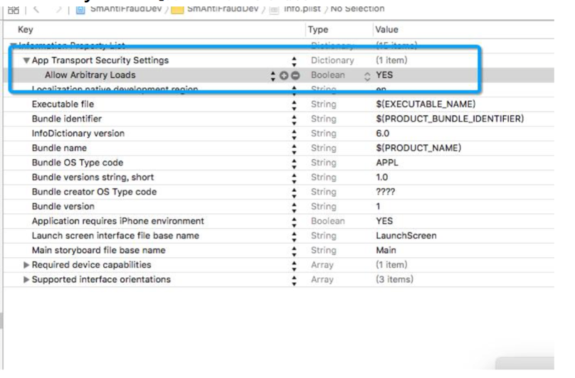

# iOS 验证码SDK接入步骤

1. **导入静态库**

   在工程下导入include文件夹和libSmCaptcha.a静态库。

2. **修改Info.plist**

   新增[Allow Arbitrary Loads]配置。如下图所示：

   

3. **初始化数美SDK中WebView控件类**

   代码如下所示：

   ```objective-c
   // 构造数美验证码WEBVIEW对象，目前宽高比为3:2
   SmCaptchaWKWebView  *_webview = [[SmCaptchaWKWebView alloc] init];
   CGRect captchaRect = CGRectMake(0, 0, width, width * 2 / 3);
   [_webview setFrame:captchaRect];
   
   // 初始化验证码WebView
   SmCaptchaOption *caOption = [[SmCaptchaOption alloc] init];
   [caOption setOrganization: @”xxxxx”];   // 必填，组织标识
   [caOption setAppId:@"xxxxx"];           // 必填，应用标识
   [caOption setHttps:YES]; 								//必填
   
   // 选填，支持滑动式（默认） 和点选式
   // SM_MODE_SLIDE  滑动点选
   // SM_MODE_SELECT  文字点选
   // SM_MODE_ICON_SELECT  图标点选
   // SM_MODE_SEQ_SELECT  语序点选
   // SM_MODE_SPATIAL_SELECT  空间逻辑推理
   [caOption setMode: SM_MODE_SLIDE];    
   
   // 选填，支持自定义样式
   [caOption setCaptchaHtml:@"https://castatic.fengkongcloud.com/pr/v1.0.4/index.html"];
   [caOption setExtOption:@{
       @"lang" : @"en", // 验证码英文主题，默认中文
       @"style": @{
           @"customFont": @{ // 自定义字体
               @"name": @"Walsheim", // 字体名，没有特别的限制
               // 这个ttf文件必须由客户配置，必须是绝对地址，以https或是http开头的url，且必须支持跨域(设置CORS)。
               @"url": @"http://castatic.fengkongcloud.com/pr/v1.0.4/assets/GT-Walsheim-Pro-Bold.ttf",
           },
           // 滑动式（MODE_SLIDE）模式下，自定义样式 withTitle 为 true 时，内容宽高比为 6:5，其它样式 3:2
           @"withTitle":@(YES),
           @"fontFamily": @"Arial", // 与customFont只能存在一种，不然会覆盖自定义字体
           @"fontWeight": @(600), // 字体粗度
           @"headerTitle": @"Vertification1", // 顶部自定义标题
           @"hideRefreshOnImage": @(YES), // 是否隐藏图片上的刷新按钮，默认是有的
           @"slideBar": @{ // 进度条自定义样式
               @"color": @"#141C30", // 进度条上默认字体颜色
               @"successColor": @"#FFF", // 成功时字体颜色
               @"showTipWhenMove":@(YES), // 当拖动的时候后面文案依旧显示
               @"process": @{
                   @"border": @"none", // 进度条边框，目前只是用来设置清除边框
                   @"background": @"#F3F8CE", // 默认进度条背景色
                   @"successBackground": @"#25BC73", // 成功时背景色
                   @"failBackground": @"#F5E0E2", // 失败时背景色
               },
               @"button": @{
                   @"boxShadow": @"none", // 按钮阴影设置，一般用来去除默认阴影的作用
                   @"color": @"#333", // 默认按钮中的icon颜色
                   @"background": @"#F6FF7E", // 默认按钮背景色
                   @"successBackground": @"#25BC73", // 成功时按钮背景色
                   @"failBackground": @"#ED816E", // 失败时按钮背景色
               }
           },
       },
   }];
   
   [caOption setTipMessage:@"xxxxx"];      // 选填，自定义提示文字，仅滑动式支持
   [caOption setChannel:@"xxxxx"];                   // 选填，渠道标识
   
   // 连接新加坡机房特殊配置项，仅供验证码数据上报新加坡机房客户使用 
   // [caOption setCdnHost:@"castatic-xjp.fengkongcloud.com"];
   // [caOption setHost:@"captcha-xjp.fengkongcloud.com"];
   
   // 连接美国机房特殊配置项，仅供验证码数据上报美国机房客户使用
   // [caOption setCdnHost:@"castatic-fjny.fengkongcloud.com"];
   // [caOption setHost:@"captcha-fjny.fengkongcloud.com"];
   
   // 私有化
   // 设置验证码 url
   // [caOption setCaptchaHtml:@"YOUR_CAPTCHA_URL"];
   // 设置验证码 api 接口域名：格式 host[:port]
   // [caOption setHost:@"YOUR_HOST"];
   
   // 初始化验证码WebView
   NSInteger code = [_webview createWithOption: caOption delegate: self];
   if (SmCaptchaSuccess != code) {
   	NSLog(@"SmCaptchaWKWebView init failed %ld", code);
   } else {
   	[_captchaContainer addSubview:_webview];
   }
   
   //其中当前类需要实现SmCaptchaProtocol协议，协议需要如下函数：
   
   // 验证码图片加载成功回调函数
   - (void) onReady {
   	NSLog(@"view onReady”); 
   }
   // 处理过程出现异常回调函数
   - (void) onError:(NSInteger)code {
   	NSLog(@"view onError:%ld", code);
   }	
   
   // 用户操作结束回调函数，操作验证未通过pass为false，操作验证通过pass为true。
   - (void) onSuccess:(NSString *)rid pass:(BOOL)pass {
   	NSLog(@"view onSuccess:%@", rid);
   }
   ```

   

4. **将验证码WebView添加到需要展示的容器内**

5. **获取用户操作结果**

   用户操作结束后，会回调ResultListener中相应函数。如果用户操作验证结束，回调ResultListener中onSuccess函数，同时返回当前操作请求的唯一标识rid，以及操作是否通过。

6. **返回码说明**

   | 返回码 | 备注               |
   | ------ | ------------------ |
   | 0      | 成功               |
   | 1001   | 传入参数为空       |
   | 1002   | 未传入organization |
   | 1003   | 未传入appId        |
   | 1004   | 未设置回调         |
   | 1005   | 网络问题           |
   | 1006   | 返回结果出错       |
   | 2003   | 传入参数参数错误   |